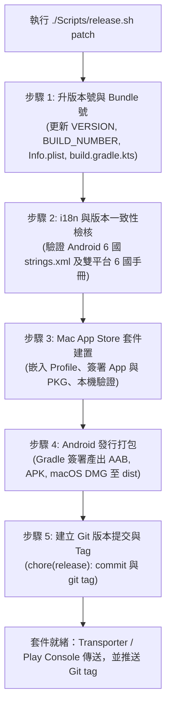

# Sync-Nexus 一鍵式通用標準發行指令體系 (Release SOP Manual)

本文件為 **Sync-Nexus** 跨平台（Mac App Store / macOS / Android）標準發行管線的官方規範說明書。本套發行體系以單一指令完成升版、檢查、雙平台建置、簽章與 Git 標記；商店傳送則使用各商店官方介面完成：macOS 使用 Apple Transporter，Android 使用 Google Play Console。

> **安全邊界**：任何腳本均不得保存或接收 Apple ID 主密碼、App 專用密碼。macOS `.pkg` 不由命令列腳本直接上傳。

---

## 核心設定與版本單一真相來源 (Single Source of Truth)

專案嚴格維持以下檔案為全局版本與識別碼之單一來源：
* **`VERSION`**：語意化版本號（如 `0.1.5`，對應行銷版本號 `CFBundleShortVersionString`、`versionName`）。
* **`BUILD_NUMBER`**：單調遞增整數（如 `6`，對應 Bundle 號 `CFBundleVersion`、`versionCode`）。
* **`Bundle Identifier`**：`com.syncnexus.app`（Apple Developer 與 Android 統一識別碼）。
* **`Team ID`**：`6UJ8GS752W`。

---

## 一、一鍵發行指令速查清單 (Cheat Sheet)

### 1. 一鍵產出正式發行套件（最常用、最核心指令）
執行完整的 5 階段建置流程：
```bash
./Scripts/release.sh patch
```
> **支援參數**：
> * `./Scripts/release.sh patch`：升級修訂版號（如 `0.1.5` $\rightarrow$ `0.1.6`，build 號 +1）。
> * `./Scripts/release.sh minor`：升級次版號（如 `0.1.5` $\rightarrow$ `0.2.0`，build 號 +1）。
> * `./Scripts/release.sh major`：升級主版號（如 `0.1.5` $\rightarrow$ `1.0.0`，build 號 +1）。
> 
> **執行完成後的商店操作**：
> 1. 使用 Apple Transporter 傳送產出的 macOS `.pkg`。
> 2. 正式發佈 Android 時，將 `.aab` 上傳 Google Play Console。
> 3. 執行 `git push && git push --tags` 推送版本紀錄。

---

### 2. 獨立發行檔產出（免上架、直接分享給他人體驗）
無論是透過通訊軟體傳送給朋友、或是放在官網供用戶下載，使用 `dist.sh`：
```bash
# 同時產生 macOS DMG 與 Android APK/AAB
./Scripts/dist.sh --mac --android

# 僅產出 macOS 獨立 DMG 安裝檔
./Scripts/dist.sh --mac

# 僅產出 Android 正式簽章 APK 與 AAB
./Scripts/dist.sh --android
```

產出物將自動集結於 `build/dist/v<版本號>-b<Build號>/`：
* `SyncNexus-<版本號>-mac.dmg`：macOS 拖曳安裝映像檔（內建 Applications 捷徑）。
* `SyncNexus-<版本號>-android.apk`：**已通過 Release 金鑰簽章**，任何 Android 手機/平板可直接點擊安裝體驗。
* `SyncNexus-<版本號>-android.aab`：已簽章之 Google Play Store 正式發行套件。
* `安裝說明.txt`：自動生成的繁體中文安裝指引。

---

### 3. 子任務與分段發行（依平台單獨處理）

| 需求場景 | 終端機指令 | 說明 |
|---|---|---|
| **只升級版本號** | `./Scripts/release.sh bump [patch\|minor\|major]` | 僅更新 `VERSION`、`BUILD_NUMBER` 與雙端配置，不打包 |
| **只打包 Mac App Store** | `./Scripts/release.sh apple` | 檢查 i18n、嵌入 Profile、簽署並生成 `.pkg` |
| **上傳 Mac App Store** | Apple Transporter | 將 `build/SyncNexus-<版本>-b<Build>.pkg` 拖入並按「傳送」 |
| **只打包 Android** | `./Scripts/release.sh android` | 檢查 i18n 後執行 Gradle 生成正式簽名 APK 與 AAB |
| **手動校驗 6 國語系** | `./Scripts/check_i18n.sh` | 檢查 Android 與說明文件 6 國語言覆蓋率 |

---

## 二、一鍵式全自動發行流程圖解 (Pipeline Architecture)

當您執行 `./Scripts/release.sh patch` 時，背後自動串聯執行的 5 大關卡如下：



---

## 三、各腳本模組職責說明

專案內的 `Scripts/` 目錄已進行標準模組化劃分，各腳本皆具備獨立執行與組合調用能力：

```
Scripts/
├── release.sh                  <-- [主控樞紐] 一鍵全流程發行 SOP 指令
├── dist.sh                     <-- [整合發行] 產出官網與分享用 DMG、APK、AAB 及安裝說明
├── check_i18n.sh               <-- [品質把關] 驗證 Android 與獨立文檔 6 國語言完整性
├── bump-version.sh             <-- [版本控制] 單一來源版號遞增器
├── package_macos_app_store.sh  <-- [Apple 專用] 嵌入 Profile、PKG 封裝、證書簽名與本機驗證
├── package_macos_dmg.sh        <-- [Apple 專用] 製作高相容性 UDZO 壓縮 DMG
├── package_android.sh          <-- [Android 專用] 綁定 release-key.jks 產出已簽名 APK/AAB
└── build-app.sh                <-- [底層編譯] macOS AppKit/SwiftUI 編譯與代碼簽名器
```

---

## 四、Mac App Store 標準發行程序

### A. 一次性準備

1. Keychain 內必須有 `Apple Distribution` 與 `Mac Installer Distribution`（舊名稱為
   `3rd Party Mac Developer Installer`）憑證及其私鑰。
2. 建立 **Mac App Store Connect** Provisioning Profile：
   - Profile Type：`Mac`，不是 `Mac Catalyst`。
   - App ID：`com.syncnexus.app`。
   - Distribution certificate：選擇與本機私鑰配對的憑證。
3. 將下載的 `.provisionprofile` 放在專案根目錄、安裝至 Xcode，或在打包時設定
   `APP_PROVISIONING_PROFILE=/absolute/path/profile.provisionprofile`；腳本會依序尋找並驗證。
4. `.provisionprofile` 與 `.mobileprovision` 已列入 `.gitignore`，不得提交至 Git。

### B. 每次發行

```bash
./Scripts/release.sh apple
```

腳本會依序檢查 Profile 的平台、Team ID、App ID 與期限，將 Profile 嵌入
`SyncNexus.app/Contents/embedded.provisionprofile`，使用 Apple Distribution 簽署 App，使用
Mac Installer Distribution 簽署 `.pkg`，最後執行 `codesign` 與 `pkgutil` 本機驗證。

成功後開啟 Transporter，拖入：

```text
build/SyncNexus-<版本號>-b<Build號>.pkg
```

按「傳送」後等待 Transporter 成功訊息，再前往 App Store Connect 等候 Build 處理完成。

### C. 禁止事項

- 不使用 `Scripts/package_macos_app_store.sh --upload`；此模式已停用。
- 不把 Apple ID、主密碼或 App 專用密碼寫入腳本、環境設定檔或 Git。
- 不使用未簽名 `.pkg` 上傳。
- 不重複上傳相同 `BUILD_NUMBER`；被拒後必須先遞增 Build 號。

---

## 五、免上架分享 APK 與日後上架 Google Play 之無縫銜接

1. **分享體驗免上架**：
   * 專案內建專屬金鑰庫 `Platforms/Android/release-key.jks`（有效期限至 2054 年）。
   * `package_android.sh` 編譯出的 `dist/SyncNexus-<版本號>-android.apk` 已經過 **APK Signature Scheme v2** 認證。
   * **任何人拿到此 APK 均可直接安裝於 Android 8.0 至 Android 15 設備上，無任何權限阻礙或未簽名錯誤**。
2. **日後上架 Google Play**：
   * 同批次生成的 `dist/SyncNexus-<版本號>-android.aab` 使用同一把金鑰簽署，完全相容 Google Play 要求。
   * 日後若要在 Google Play 上架，直接將該 `.aab` 拖曳上傳至 Google Play Console 即可，代碼與金鑰完全不需要更動。
