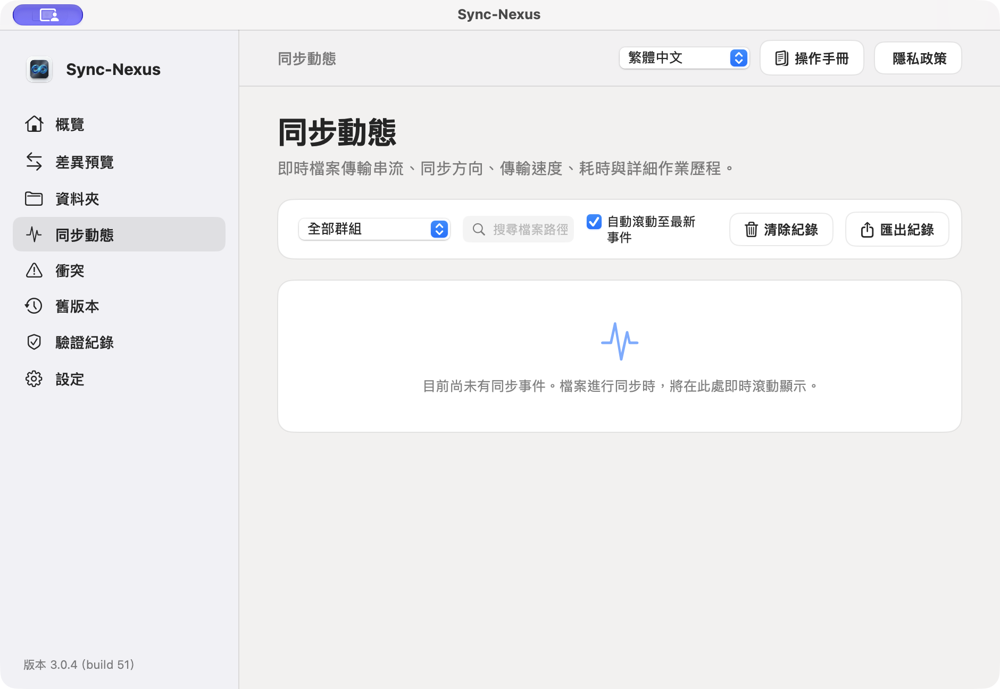

# SyncNexus 操作使用手冊 — Apple (macOS) 完整指南

> **適用平台**：macOS 14.0 (Sonoma) 及更新版本  
> **目前版本**：1.2.0（build 22）  
> **核心設計原則**：本機優先（Local-First）、零雲端伺服器綁定（Zero-Cloud）、絕對資料安全（Trash-First & History-Protected）

---

## 頁首導覽列功能說明

在主視窗的最上方，配置了全域操作的頁首導覽列：

```
[ 當前頁面主題標題 ] ------------------------- [ 語系切換下拉選單 ▾ ] [ 📖 操作手冊 ] [ 🛡️ 隱私政策 ]
```

1. **語系切換下拉式選單**：
   - **實際位置**：頁首右上角第一個控制元件。
   - **功能用途**：支援即時切換 6 種介面語系（繁體中文、簡體中文、English、日本語、한국어、ภาษาไทย）。
   - **操作方式**：點擊展開下拉選單，選取目標語言，整個應用程式介面立即切換，無須重啟。
2. **操作說明手冊按鈕（📖 圖示）**：
   - **實際位置**：語系選單右側。
   - **功能用途**：直接以原生應用內浮動視窗展開本操作手冊，免聯網、不重定向至 GitHub 網頁。
   - **操作方式**：點擊開啟，隨時查閱各頁面功能與操作指引；按 `Esc` 或「關閉」隨時返回工作畫面。
3. **隱私權政策按鈕（🛡️ 圖示）**：
   - **實際位置**：操作手冊按鈕右側。
   - **功能用途**：查閱 SyncNexus 的零雲端隱私安全規範與沙盒安全邊界。

---

## 第一章：概覽 (Overview)


### 1.1 頁面功能定位與目的
「概覽」是 SyncNexus 的**全局健康儀表板**。您無須深入檢查個別檔案，只要看一眼概覽頁，就能掌握整個同步系統的健康狀態、監控檔案總量、上次完整驗證時間、歷史版本容量與各端點連線狀況。

### 1.2 【零基礎新手教學：手把手操作程序】
- **【步驟 1：檢視頁首快捷工具】**：主視窗最上方右側常駐「語系選單」、「操作手冊 📖」與「隱私政策 🛡️」按鈕，點擊可隨時切換 6 國語言或展開原生手冊。
- **【步驟 2：確認全局健康燈號】**：看一眼左上方健康徽章：綠燈「全部正常」代表一切就緒；若轉為黃燈「警告」，代表有端點離線、衝突或異常事件需要留意。
- **【步驟 3：應對大量刪除攔截卡片】**：若單次刪除超過 25 個檔案或 25%，標題下方會自動彈出醒目的防護卡片並暫停同步；點擊右側「審核並確認」按鈕，在審核清單中點選「確認放行」或「取消並恢復」。
- **【步驟 4：查看端點與同網 P2P】**：中央卡片列出目前同步群組的所有資料夾狀態；若同 Wi-Fi 內有其他執行 SyncNexus 的設備，下方 P2P 區塊會自動顯示「在線」直連。

### 1.3 介面按鈕位置、產出現象與安全防護機制

| 元件名稱 | 畫面實際位置 | 用途與目的 | 操作方式 | 產出之現象與安全機制 |
| :--- | :--- | :--- | :--- | :--- |
| **全局健康徽章** | 頂部主標題左側 | 顯示目前系統整體同步狀態（綠燈正常／黃燈警告） | 自動監控，無須手動操作 | 綠燈顯示「全部正常」；若有端點離線、檔案衝突或大量刪除，轉為黃燈提示。 |
| **大量變更確認卡片** | 頂部標題下方（僅異常時出現） | 防止手殘或惡意軟體瞬間清空檔案的最後防線 | 點擊卡片右側「**審核並確認**」 | 當單次刪除超過 25 個檔案或佔比 > 25% 時自動攔截並暫停同步，待您確認後才放行。 |
| **追蹤檔案數卡片** | 數據指標區第 1 格 | 即時呈現目前由 SyncNexus 納入同步監控的檔案總量 | 唯讀顯示 | 標註「SHA-256 即時追蹤」，每次檔案變動均即時更新數字。 |
| **最近完整驗證卡片** | 數據指標區第 2 格 | 追蹤上次執行深層 SHA-256 逐位元完整性比對的時間 | 唯讀顯示 | 若有疑似損壞檔案，下方副標題會即時顯示「發現 X 個疑似損毀」提醒您處理。 |
| **舊版本容量卡片** | 數據指標區第 3 格 | 呈現防誤刪歷史庫所佔用的磁碟空間與保留天數 | 唯讀顯示 | 顯示如「24.5 MB · 保留30天，可隨時還原」，點擊側欄「舊版本」可管理。 |
| **儲存端點狀態卡片** | 中央網格區域 | 檢視每個同步目錄的即時狀態、路徑與檔案系統特徵 | 檢視卡片資訊 | 顯示「在線」綠色徽章或「離線」黃色徽章；若為外接碟則標記「可移除 / ExFAT」。 |
| **P2P 局域網直連卡片** | 下方網路區塊 | 同 Wi-Fi 下自動尋找其他運行 SyncNexus 的 Mac 或 Android 設備 | 自動偵測搜尋中 | 發現設備時顯示設備名稱與綠色「在線」徽章，點對點直連傳輸。 |

### 1.4 日常使用秘訣與避坑指南
- 平時只要確認上方顯示綠燈「全部正常」，代表所有端點檔案隨時保持一致，您完全不需手動干預即可安心工作。

---

## 第二章：差異預覽 (Diff Preview)


### 2.1 頁面功能定位與目的
在正式寫入磁碟之前，「差異預覽」提供**模擬對帳試跑（Dry-Run）**功能。對於管理重要專案、大容量資料夾的使用者，能事前預知即將複製、更名或刪除的項目，零風險確認安全無虞。

### 2.2 【零基礎新手教學：手把手操作程序】
- **【步驟 1：點擊執行試跑模擬】**：在頂部卡片左側，點擊藍色「執行試跑模擬」按鈕。按鈕立即轉為「模擬計算中...」，系統在背景深度比對各端點，不修改任何磁碟檔案。
- **【步驟 2：建立 APFS 快照防線（選用）】**：在大規模同步前，可點擊「APFS 快照安全防護」建立系統還原點；若因系統限制無法建立，頂部會跳出快顯 Toast 提示說明系統已自動啟用垃圾桶與歷史庫雙重防線。
- **【步驟 3：核對變更清單與符號】**：計算完成後下方展開變更清單：綠色 `+` 代表新增複製；藍色 `➔` 代表智慧更名；紅色 `−` 代表刪除（標註優先移入垃圾桶）。若無變動則顯示綠色勾勾「所有端點完全一致」。
- **【步驟 4：點擊確定執行同步】**：確認變更項目無誤後，點擊清單右下角「確定執行同步」按鈕，系統將變更寫入各端點，完成後頂部彈出 Toast 提示「同步作業已完成」。

### 2.3 介面按鈕位置、產出現象與安全防護機制

| 按鈕 / 元件名稱 | 畫面實際位置 | 用途與目的 | 操作方式 | 產出之現象與安全機制 |
| :--- | :--- | :--- | :--- | :--- |
| **執行試跑模擬** | 頂部主卡片左側（藍色主要按鈕） | 在不更動任何磁碟實體檔案的前提下，模擬比對所有端點差異 | 點擊按鈕，按鈕轉為「模擬計算中...」 | 計算完成後於下方展開詳細的預覽清單，顯示總變動筆數（如「共有 3 個項目即將同步」）。 |
| **確定執行同步** | 模擬清單右下方（審核無誤後出現） | 將預覽核對過的變更真正寫入至所有目標端點 | 點擊確認同步 | 系統立即啟動多端點檔案同步作業，頂部彈出同步成功快顯提示。 |
| **APFS 快照安全防護** | 「執行試跑模擬」按鈕右側 | 呼叫 macOS 系統級 APFS 快照，在大型變更前建立系統還原點 | 點擊按鈕觸發建立 | 成功時彈出「已建立 APFS 安全快照」；若磁碟格式不支援或非管理員權限，頂部跳出快顯 Toast 提示說明（如下圖）。 |


> **預覽符號說明**：
> - 🟢 **`+` (綠色圖示)**：預計新增或自其他端點複製過來的檔案。
> - 🔵 **`➔` (藍色圖示)**：預計在目標端點重新命名的檔案（避免重複傳輸）。
> - 🔴 **`−` (紅色圖示)**：預計刪除的檔案（**安全保證：一律先移入 macOS 垃圾桶，絕不硬刪**）。

### 2.4 日常使用秘訣與避坑指南
- 在整理重要大專案或批次刪除整理前，先至本頁點擊「執行試跑模擬」，核對清單確認安全後再同步，萬無一失。

---

## 第三章：資料夾 (Folders)


### 3.1 頁面功能定位與多資料夾同步群組 (Sync Groups)
「資料夾」是設定同步目標的核心基地。SyncNexus 採用業界頂尖的**「同步群組（Folder Groups）」架構模型**：
- **支援多任務獨立同步**：您可以同時建立多個獨立的同步群組（例如：「工作專案」、「家庭相片」、「個人財務」）。
- **全管線與排程隔離**：每個群組擁有專屬的 2~N 個端點資料夾、獨立的 SQLite 狀態資料庫、獨立的檔案變更監聽管線與檔案鎖（SyncLock）。群組 A 正在同步大檔案時，群組 B 的小檔案同步完全不受影響，絕不互相卡頓！

### 3.2 【零基礎新手教學：手把手操作程序】
- **【步驟 1：建立與切換同步群組】**：
  1. 點擊頂部同步群組列的「**＋ 新增群組**」，輸入群組名稱（如：工作專案、家庭相片）並選擇代表圖示後儲存。
  2. 點擊上方不同群組標籤（Chips）即可隨時切換，下方端點清單即刻顯示該群組所屬的資料夾。
  3. 點擊「**✎ 編輯同步群組**」可重新命名或安全刪除群組（實體檔案完整保留於磁碟）。
- **【步驟 2：點擊加入資料夾按鈕】**：在頁面底部點擊藍色「**加入資料夾...**」按鈕，打開系統訪達（Finder）選取對話框（每個群組至少需加入 2 個資料夾以建立同步網絡）。
- **【步驟 3：依指引選取 4 大儲存位置】**：
  1. **電腦本機資料夾**：打開 Finder ➔ 點擊側邊欄「文件」或個人專屬目錄 ➔ 選取目標資料夾。
  2. **iCloud 雲碟 (iCloud Drive)**：打開 Finder ➔ 點擊側邊欄「iCloud 雲碟」➔ 選取目標資料夾。SyncNexus 自動處理雲端佔位符，確保檔案在本地水合（Download）後安全同步。
  3. **Google 雲端硬碟 (Google Drive)**：打開 Finder ➔ 點擊側邊欄「Google Drive」➔ 進入「我的雲端硬碟」➔ 選取目標資料夾。
  4. **外接隨身碟 / 行動硬碟 (USB / Type-C)**：插上隨身碟 ➔ 打開 Finder ➔ 側邊欄「位置」選取該隨身碟 ➔ 選取目標資料夾（**強烈建議格式化為 ExFAT**）。
- **【步驟 4：更換或移除端點】**：路徑搬移時點擊端點卡片右側「**更換資料夾...**」；若要解除同步點擊「**移除...**」（僅解除關聯，絕不刪除實體檔案）。

### 3.3 介面按鈕位置、產出現象與安全防偽標記

| 按鈕 / 元件名稱 | 畫面實際位置 | 用途與目的 | 操作方式 | 產出之現象與安全機制 |
| :--- | :--- | :--- | :--- | :--- |
| **＋ 新增群組** | 頂部同步群組列右側 | 建立新的多向同步群組 | 點擊並輸入名稱、選取圖示 | 頂部新增群組標籤，自動切換至新群組空白狀態。 |
| **✎ 編輯同步群組** | 目前群組資訊卡片右側 | 修改當前群組名稱、圖示或刪除群組 | 點擊開啟編輯彈窗 | 支援更名、更換圖示；刪除時安全脫鉤，磁碟內實體檔案完整保留。 |
| **加入資料夾...** | 列表底部藍色主要按鈕 | 授權並將新目錄加入多向同步網絡中 | 點擊並於 Finder 對話框中選取目錄 | 自動寫入 `.syncnexus-endpoint` 專屬 UUID 防偽檔，建立 App Sandbox 安全書籤。 |
| **更換資料夾...** | 每個端點卡片右側第一個按鈕 | 當目錄搬移或隨身碟掛載點改變時重新定向 | 點擊並選取新路徑 | 系統驗證標記檔無誤後自動恢復連線；若路徑無效則彈出提示。 |
| **移除...** | 每個端點卡片右側第二個按鈕 | 將該資料夾從同步清單中脫鉤 | 點擊並於確認對話框點擊確認 | 僅解除同步監控，**絕不會刪除資料夾內的實體檔案**。 |
| **防偽標記防護** | 端點卡片狀態警示區 | 防止插錯隨身碟或選錯目錄導致資料覆蓋 | 系統即時自動驗證 | 若隨身碟被更換，顯示「標記檔與此端點不符，已停止傳播任何變更」（如下圖），主動隔離保護！ |


### 3.4 日常使用秘訣與避坑指南
- 外接隨身碟格式化為 ExFAT，SyncNexus 會自動啟動「檔名相容 ExFAT / Windows」過濾，防止非法字元導致同步失敗。

---

## 第四章：同步動態 (Activity Center)



### 4.1 頁面功能定位與即時串流監控
「同步動態」是 SyncNexus 專屬的**實時傳輸視窗與歷史追蹤中心**。
過去的置頂訊息無法移動、無法追溯先前完成了哪些任務，且在多群組同時運作時無法看清全貌。「同步動態」專屬視窗徹底解決了此痛點：
- **滾動式即時串流**：以毫秒級時間軸條列所有檔案複製、搬移、刪除與建立目錄事件。
- **全方位數據欄位**：包含時間、群組、**同步方向（哪端 ➔ 哪端）**、動作類型、檔案大小、傳輸速度（KB/s、MB/s）、耗時與檔案路徑。
- **彈性群組篩選**：支援下拉切換觀看「全部群組」或僅鎖定單一群組。
- **即時速度與審核匯出**：提供動態置頂捲動開關，並支援一鍵匯出完整活動日誌（CSV）。

### 4.2 【零基礎新手教學：手把手操作程序】
- **【步驟 1：依群組篩選】**：點擊左上方下拉選單，可自由選擇觀看「全部群組」的匯總動態，或切換僅檢視特定單一群組。
- **【步驟 2：即時掌握同步方向與速度】**：表格清楚列出時間、群組、同步方向（例如：本機 ➔ 外接隨身碟）、動作（複製/搬移/垃圾桶）、檔案大小、傳輸速度（KB/s、MB/s）與耗時。
- **【步驟 3：自動置頂追蹤】**：勾選「自動滾動至最新事件」，新檔案寫入時清單自動捲動並聚焦於最新事件。
- **【步驟 4：一鍵匯出 CSV】**：點擊右上角「匯出 CSV...」按鈕，可將完整操作日誌存檔，便於稽核與效能分析。

### 4.3 介面按鈕位置、產出現象與安全機制

| 元件名稱 | 畫面實際位置 | 用途與目的 | 操作方式 | 產出之現象與安全機制 |
| :--- | :--- | :--- | :--- | :--- |
| **群組篩選器** | 頂部工具列左側 | 切換動態顯示範圍 | 點擊下拉選單選取 | 可選「全部群組」或單一群組，表格即時過濾顯示。 |
| **自動滾動核取方塊** | 頂部工具列中央 | 是否自動追蹤最新動態 | 點擊勾選或取消 | 勾選時，有新檔案完成同步自動捲動至最頂端最新列。 |
| **匯出 CSV 按鈕** | 頂部工具列右側 | 將同步歷史匯出存檔 | 點擊開啟存檔視窗 | 產生標準逗號分隔 CSV 檔案，包含時間、方向、大小、速率等。 |
| **同步方向欄位** | 表格第 3 欄 | 清楚指示資料由哪個資料夾同步至哪個資料夾 | 唯讀顯示 | 呈現清晰端點箭頭指示（如 `Local ➔ Mobil`）。 |
| **速率與耗時欄位** | 表格第 6、7 欄 | 即時掌握傳輸效率與硬體表現 | 唯讀顯示 | 動態計算真實吞吐量，傳輸中不卡頓主執行緒。 |

---

## 第五章：衝突 (Conflicts)


### 5.1 頁面功能定位與目的
當您在無網路或離線狀態下，同時在兩台電腦修改了同一個檔案（例如 Mac 改了第 5 行、Windows 改了第 10 行），傳統軟體常會直接把其中一方蓋掉造成悲劇。SyncNexus 堅持**「絕對不覆蓋」原則**：將衝突版本妥善另存為 `檔名 (conflict ...)`, 並集中於本頁讓您自主比對與決定。

### 5.2 【零基礎新手教學：手把手操作程序】
- **【步驟 1：察看側欄衝突警示紅標】**：當離線時兩端同時編輯同個檔案，側邊欄「衝突」圖示會亮起紅色數字徽章，點擊進入衝突管理頁面。
- **【步驟 2：左右並列對照兩份版本】**：中央呈現雙欄卡片：左欄為「目前主要版本」，右欄為「來自端點版本」（標註綠色「較新」標籤），清楚列出檔案大小、修改時間與來源端點。
- **【步驟 3：在訪達中打開比對內容】**：若想詳細比對內文，點擊兩側卡片內的「在 Finder 中顯示」按鈕，系統自動在訪達中標出該檔案，方便以文字編輯器打開檢查。
- **【步驟 4：點擊仲裁按鈕完成解決】**：
  - 點擊左側「**保留此版本**」：以主要版本為標準推播至各端點，衝突副本安全歸檔。
  - 點擊右側「**改用此版本**」：採用衝突副本取代主要檔案，舊版本自動存入「舊版本庫」備份。
  - 完成後側欄紅標歸零，顯示「沒有未解決的衝突」。

### 5.3 介面按鈕位置、產出現象與雙版本仲裁

| 按鈕 / 元件名稱 | 畫面實際位置 | 用途與目的 | 操作方式 | 產出之現象與安全機制 |
| :--- | :--- | :--- | :--- | :--- |
| **保留此版本** | 左側「目前主要版本」卡片下方 | 決定採用主要版本內容作為標準版本 | 點擊按鈕 | 主要版本維持現狀並推播至其他端點，衝突副本安全歸檔。 |
| **改用此版本** | 右側「衝突副本版本」卡片下方（綠色標籤「較新」） | 決定以衝突副本的內容覆蓋並作為標準版本 | 點擊按鈕 | 衝突副本內容扶正為正式檔案，舊的主要版本自動移至「舊版本庫」備份。 |
| **在 Finder 中顯示** | 兩側版本卡片內均有配置 | 在 macOS 訪達中直接定位實體檔案 | 點擊按鈕 | 系統自動打開 Finder 並反白選取該檔案，方便您用文字編輯器比對。 |
| **無衝突狀態** | 列表無任何衝突時呈現 | 確認系統內沒有任何待決衝突 | 唯讀顯示 | 呈現綠色勾勾圖示「沒有未解決的衝突，所有檔案完全一致」。 |

### 5.4 日常使用秘訣與避坑指南
- 若內容互有取捨，可先點擊「在 Finder 中顯示」，將兩份檔案的修改手動合併至主檔後，再點擊「保留此版本」。

---

## 第六章：舊版本 (Versions)


### 6.1 頁面功能定位與目的
「舊版本」是您的**歷史時光機與防手殘中心**。每當檔案被修改覆蓋、或是被同步覆寫時，被取代的舊內容會完整保存於 `.syncnexus-history` 資料庫中，讓您隨時可以一鍵找回昨天的草稿或被意外更動的內容。

### 6.2 【零基礎新手教學：手把手操作程序】
- **【步驟 1：設定歷史保留天數】**：在頂部卡片「歷史保留期限」下拉選單中，選取保留時間（7天 / 30天 / 90天 / 永久），系統會在背景自動清理逾期檔案以釋放空間。
- **【步驟 2：搜尋目標歷史檔案】**：在右上角搜尋輸入框中，輸入檔名關鍵字或資料夾名稱，歷史清單即時過濾出匹配的修訂版本。
- **【步驟 3：一鍵還原救回檔案】**：在歷史記錄項目右側，點擊「還原」按鈕；目標檔案立即被該歷史版本替換，頂部彈出成功 Toast 提示，且 2 秒內同步更新至所有其他端點。
- **【步驟 4：手動空間清理（選用）】**：若磁碟空間不足，點擊「清理過期版本」立即釋放逾期容量；點擊「清空全部」則可在通過二次確認後清空歷史庫（絕不影響正在使用的正式檔案）。

### 6.3 介面按鈕位置、產出現象與歷史時光機防線

| 按鈕 / 元件名稱 | 畫面實際位置 | 用途與目的 | 操作方式 | 產出之現象與安全機制 |
| :--- | :--- | :--- | :--- | :--- |
| **歷史保留期限選單** | 頂部卡片「自動清理」右側下拉選單 | 設定舊版本檔案在硬碟中的最長留存期限 | 點選：7天 / 30天 / 90天 / 永久 | 超過設定天數的舊版本將於背景自動清理，釋放儲存空間。 |
| **清理過期版本** | 「歷史保留期限選單」右側按鈕 | 手動觸發立即清除已逾期的歷史舊檔案 | 點擊按鈕 | 即時釋放逾期檔案佔用的磁碟空間，並更新上方容量統計數字。 |
| **清空全部** | 「清理過期版本」旁按鈕 | 徹底釋放所有歷史版本庫空間（需謹慎） | 點擊並通過二次確認彈窗 | 僅清除歷史庫內之舊檔，**絕不影響正在使用的最新正式檔案**。 |
| **搜尋過濾框** | 歷史清單右上角文字框 | 在大量歷史記錄中以檔名或端點快速篩選 | 輸入關鍵字即時過濾 | 清單即時縮減為符合條件的檔案，支援副檔名與路徑搜尋。 |
| **在 Finder 中顯示** | 搜尋框右側按鈕 | 在訪達中檢視本機的 `.syncnexus-history` | 點擊開啟 Finder | 直達本機歷史備份目錄。 |
| **還原 (Restore)** | 每個歷史版本項目右側按鈕 | 將該特定歷史時間點的檔案救回並覆蓋回工作目錄 | 點擊「**還原**」 | 系統自動將該版本寫回原目錄，並立即同步至所有其他端點。 |

### 6.4 日常使用秘訣與避坑指南
- 誤刪或改壞檔案時，先到「舊版本」頁面搜尋檔名，點一下「還原」，資料立刻失而復得！

---

## 第七章：驗證紀錄 (Verification)


### 7.1 頁面功能定位與目的
現代硬碟可能發生無聲資料損壞（Silent Bit-rot），網路傳輸也可能遇到封包不全。SyncNexus 採用工業級 **SHA-256 雜湊技術**，對所有端點的所有檔案進行逐 Byte 深度比對，確保每一處檔案都真真切切百分之百一致。

### 7.2 【零基礎新手教學：手把手操作程序】
- **【步驟 1：啟動深層完整驗證】**：在中央卡片右側，點擊藍色「立即執行完整驗證」按鈕。系統在背景逐一計算所有端點檔案的 SHA-256 雜湊值。
- **【步驟 2：檢視驗證結果報告】**：驗證完成後，頂部更新「最近完整驗證」時間戳記。若所有檔案一致，顯示綠色徽章「全部正常，沒有異常」；若發現損毀或位元錯誤，條列受影響的檔案清單。
- **【步驟 3：修復受損檔案】**：
  - 點擊「**從其他端點修復**」：系統自動從健康的端點下載乾淨正確的副本覆蓋修復，受損檔案先備份進歷史庫後修復。
  - 點擊「**接受目前內容**」：若變更為有意修改，點擊重新計算基準雜湊值並解除警報。
- **【步驟 4：了解四大內建防線】**：頁面底部卡片詳細列出：每次複製校驗雜湊、外接磁碟讀回雙重檢查、覆寫前存入舊版本、大量刪除攔截。

### 7.3 介面按鈕位置、產出現象與四大防線

| 按鈕 / 元件名稱 | 畫面實際位置 | 用途與目的 | 操作方式 | 產出之現象與安全機制 |
| :--- | :--- | :--- | :--- | :--- |
| **立即執行完整驗證** | 中央卡片右側藍色按鈕 | 啟動全端點深層 SHA-256 完整性雜湊比對 | 點擊「**立即驗證**」 | 背景掃描計算，驗證完畢後更新「最近完整驗證」時間與異常項目清單。 |
| **從其他端點修復** | 發現損壞異常項目時出現（主要按鈕） | 從健康完好的其他端點下載正確檔案覆蓋受損檔 | 點擊修復 | 自動從健康的端點提取乾淨副本覆寫，受損檔案先備份進歷史庫後修復。 |
| **接受目前內容** | 發現損壞異常項目時出現（次要按鈕） | 確認目前檔案內容為預期結果，重新計算雜湊 | 點擊接受 | 系統更新本機資料庫的基準雜湊，不再發出警示。 |
| **系統安全防線清單** | 頁面底部卡片 | 呈現 SyncNexus 內建的四大防護架構 | 唯讀查閱 | 標註：先進垃圾桶、防偽標記、大量刪除攔截、SHA-256 全時監控。 |

### 7.4 日常使用秘訣與避坑指南
- 建議每個月點擊一次「立即驗證」，替所有備份硬碟做一次全面的健康檢查。

---

## 第八章：設定 (Settings)


### 8.1 頁面功能定位與目的
「設定」提供個人化的同步偏好微調，包含衝突處理策略、黑名單排除規則、多國語系以及 macOS 系統完全磁碟取用權限指引。

### 8.2 【零基礎新手教學：手把手操作程序】
- **【步驟 1：挑選衝突處理原則】**：在第一張卡片中，單選「保留兩份，由我挑選（推薦，預設）」可在衝突時生成副本並由您決定；「自動採用較新，舊的存進舊版本」則自動以最新修改時間為準。
- **【步驟 2：自訂排除規則開關】**：在第二張卡片中，開啟或關閉特定類型檔案排除開關（如 `node_modules` 程式庫、`.git` 版本庫、資料庫暫存檔 `-wal`/`-shm`、照片圖庫 `.photoslibrary`），被排除項目不會被同步傳輸。
- **【步驟 3：設定語系與開機啟動】**：在第三張卡片中，使用下拉選單切換 6 國語言（繁體中文、簡體中文、English、日本語、한국어、ภาษาไทย）；切換開關設定「開機自動啟動」，登入 Mac 時自動於選單列後台守護。
- **【步驟 4：檢查完全取用磁碟權限】**：在權限卡片中，若顯示黃燈「未授權」，點擊「開啟系統設定」按鈕直達 macOS「隱私權與安全性 ➔ 完全取用磁碟」，勾選 SyncNexus 即可獲取完整讀寫權限；下方另有「開啟日誌檔案」可調閱即時診斷記錄。

### 8.3 介面按鈕位置、產出現象與權限設定

| 設定項目 | 畫面實際位置 | 用途與目的 | 選項與操作方式 | 產出之現象與安全機制 |
| :--- | :--- | :--- | :--- | :--- |
| **衝突處理原則** | 頂部第一張卡片 | 設定發生雙邊同時編輯時的預設仲裁模式 | 單選：<br>1. **保留兩份，由我挑選**（推薦，預設）<br>2. **自動採用較新，舊的存進舊版本** | 選項 1 絕不覆蓋，保留 conflict 檔於「衝突」頁；選項 2 自動以修改時間最新為準，被覆蓋者送入「舊版本」。 |
| **排除規則開關** | 第二張卡片 | 排除無須同步或可能造成損壞的特殊目錄 | 獨立切換開關：<br>• `node_modules`（專案套件）<br>• `.git`（版本控制庫）<br>• 資料庫暫存檔（`-wal`, `-shm`）<br>• 照片圖庫（`.photoslibrary`） | 開啟後，該類型檔案於所有端點均原封不動，不予傳輸，大幅節省頻寬與硬碟負擔。 |
| **介面語系** | 第三張卡片頂部 | 設定軟體顯示語言 | 下拉選單選取 6 種語言 | 整個 App 即時切換語系。 |
| **開機自動啟動** | 語系設定下方切換開關 | 設定 Mac 開機登入時是否自動在後台啟動 | 開啟 / 關閉 Switch 開關 | 開啟後隨 macOS 登入自動於選單列後台守護，隨時保持同步。 |
| **磁碟取用權限** | 權限狀態卡片 | 檢查是否已取得系統檔案讀寫授權 | 顯示綠燈「已授權」或黃燈「未授權」 | 若未授權，點擊「**開啟系統設定**」直達 macOS「隱私權與安全性 ➔ 完全取用磁碟」（如下圖），將 SyncNexus 勾選開啟即可。 |
| **開啟日誌檔案** | 頁面底部左側按鈕 | 調閱即時同步偵錯與傳輸日誌 | 點擊按鈕 | 於系統「主控台（Console）」或文字編輯器中開啟即時日誌檢視。 |
| **使用說明指引** | 「開啟日誌檔案」旁按鈕 | 重新開啟初次安裝時的歡迎導覽視窗 | 點擊按鈕 | 彈出 Onboarding 引導精靈，方便回顧新手說明。 |


### 8.4 日常使用秘訣與避坑指南
- 寫程式的使用者強烈建議開啟 `node_modules` 排除開關，可節省數萬個碎小檔案的傳輸時間，大幅提升同步效率。

---

## 總結：日常安心使用守則

1. **放鬆工作，免手動按鍵**：只要端點均呈現「在線」，在任一資料夾內存檔或改名，2 秒內所有端點自動完成同步。
2. **有疑慮先「試跑模擬」**：在大批搬移或重整檔案前，先到「差異預覽」按一下「執行試跑模擬」，萬無一失。
3. **誤刪檔案免驚慌**：先翻 Mac「垃圾桶」；若已被清理，直接進「舊版本」頁面點擊「還原」，資料永遠都在！
