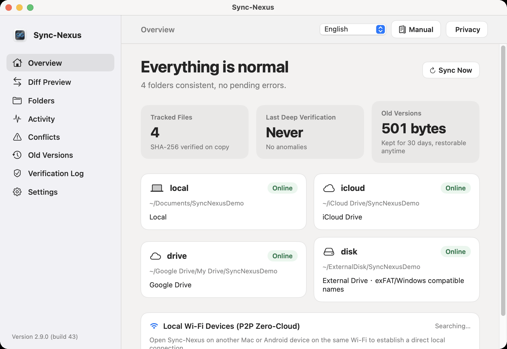
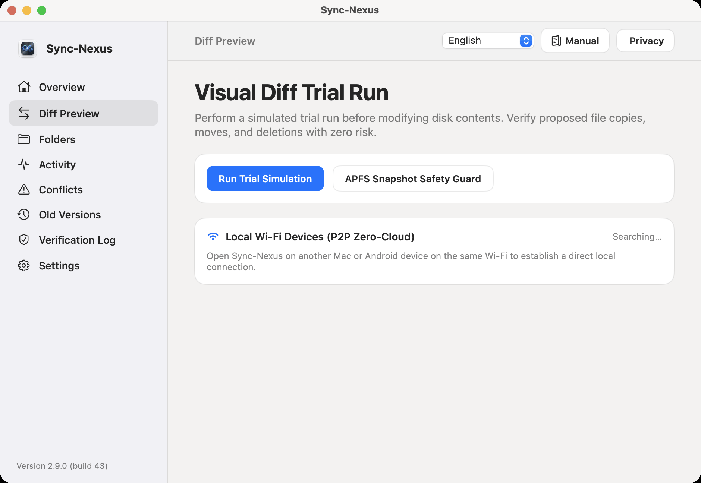
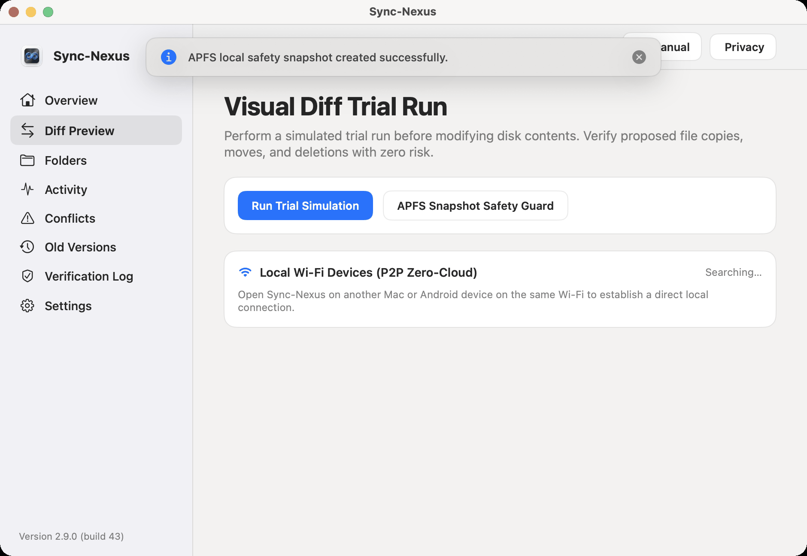
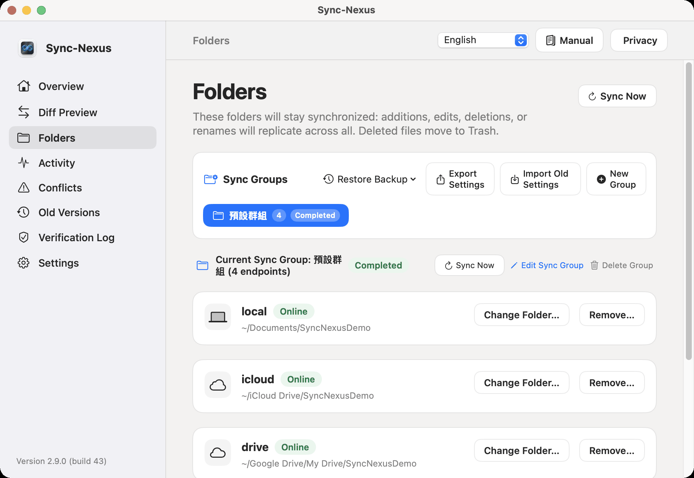
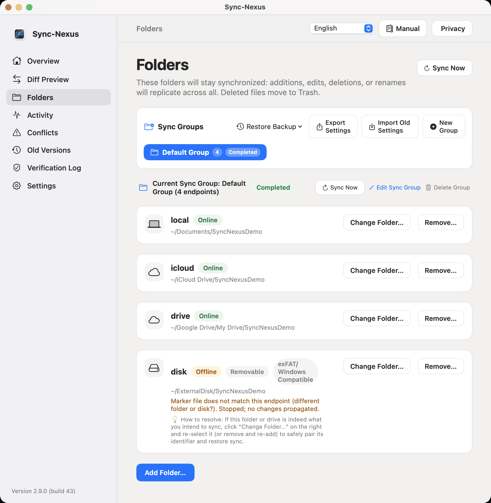
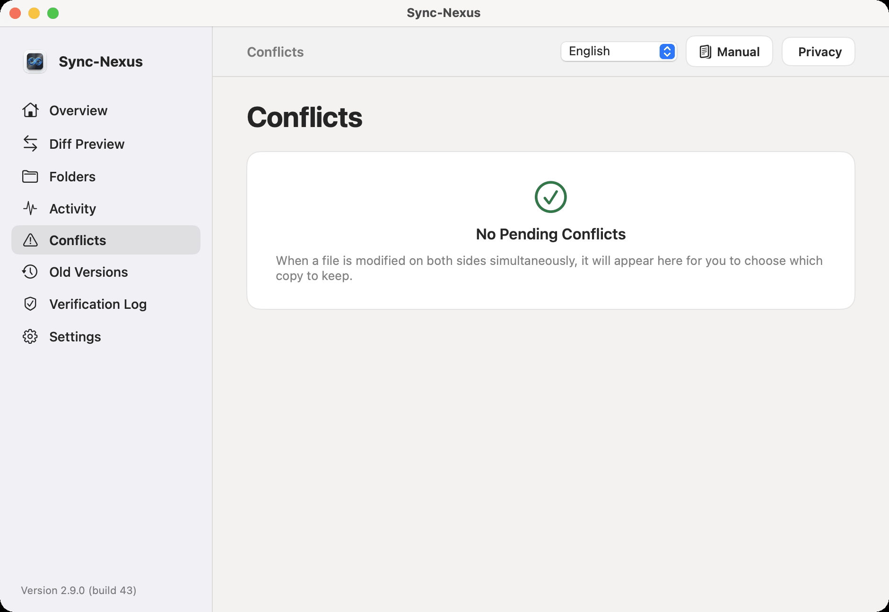
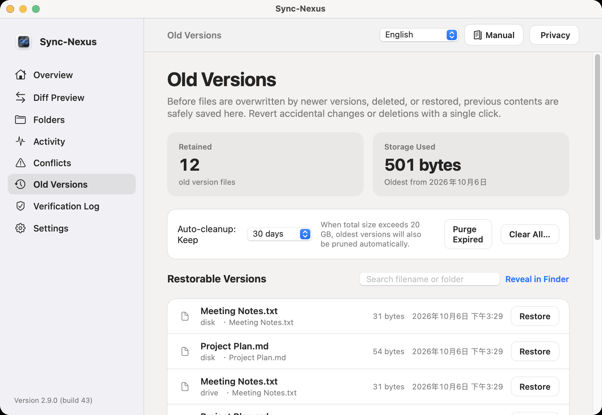
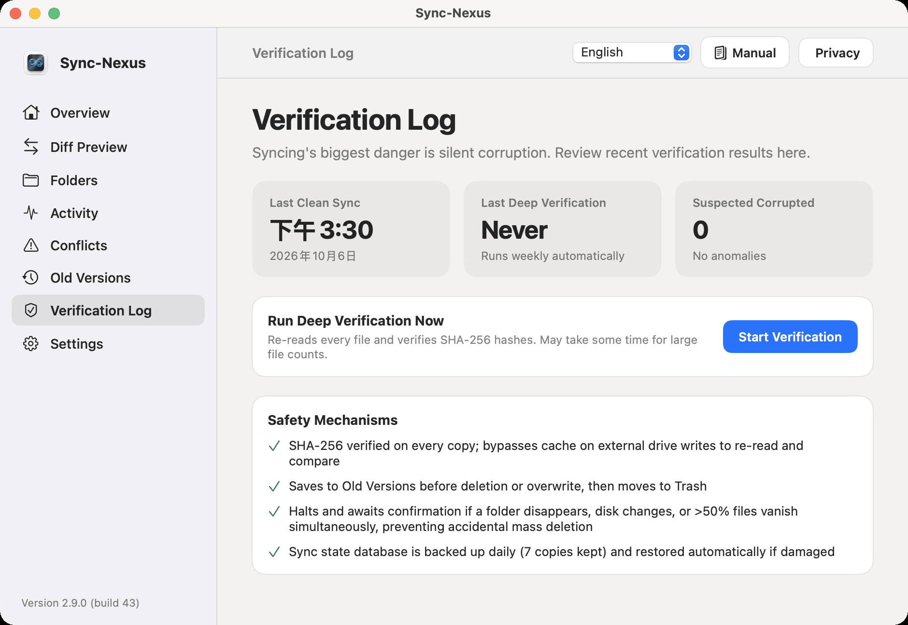
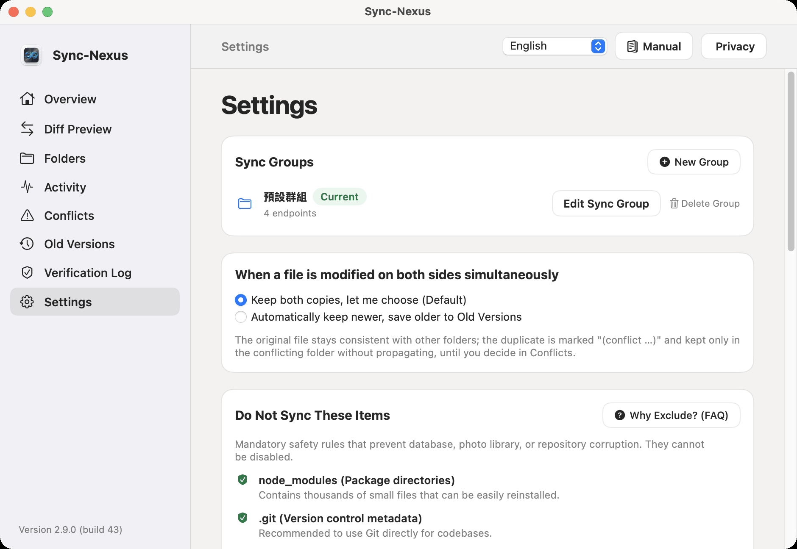

# SyncNexus User Operation Manual — Apple (macOS) Complete Guide

> **Applicable Platform**: macOS 14.0 (Sonoma) and later  
> **Current Version**: 1.2.0 (build 22)  
> **Core Architecture**: Local-First, Zero-Cloud Server Binding, Absolute Data Protection (Trash-First & History-Protected)

---

## Top Navigation Header

At the very top of the main window, the global navigation header is arranged as follows:

```
[ Current Page Title ] ------------------------- [ Language Menu ▾ ] [ 📖 Manual ] [ 🛡️ Privacy ]
```

1. **Language Dropdown Picker**:
   - **Location**: Top-right corner of the header.
   - **Purpose**: Instantly switches between 6 interface languages (Traditional Chinese, Simplified Chinese, English, Japanese, Korean, Thai).
   - **How to Use**: Click to open the dropdown and pick your preferred language. The entire app switches instantly without restart.
2. **User Manual Button (📖 icon)**:
   - **Location**: Next to the language menu.
   - **Purpose**: Opens this complete user manual directly in a native in-app sheet. No internet connection required, no redirecting to external GitHub pages.
   - **How to Use**: Click to open. Press `Esc` or click "Close" to return to your work.
3. **Privacy Policy Button (🛡️ icon)**:
   - **Location**: Next to the manual button.
   - **Purpose**: Displays SyncNexus's zero-cloud privacy commitments and App Sandbox security guarantees.

---

## Chapter 1: Overview



### 1.1 Purpose and Objectives
The **Overview** is SyncNexus's **global health dashboard**. Without having to inspect individual files, you can see system health at a glance, monitor total tracked files, check the last deep verification timestamp, view history capacity, and verify storage endpoint statuses.

### 1.2 【Zero-Foundation Beginner Tutorial: Step-by-Step Instructions】
- **【Step 1: Check Header Quick Bar】**: The top-right header features the Language Picker, 'User Manual 📖', and 'Privacy 🛡️' buttons. Click anytime to switch between 6 languages or open this in-app manual without browser redirects.
- **【Step 2: Check Global Health Badge】**: Glance at the top-left badge: Green "All Normal" means all systems are healthy; Yellow "Warning" alerts you to offline folders, pending conflicts, or anomalous events.
- **【Step 3: Handle Mass Deletion Safeguard】**: If >25 files or >25% of files are deleted at once, a safety banner pops up below the header and halts sync; click "Review and Confirm" on the right to examine the file list and choose "Confirm Deletion" or "Cancel & Restore".
- **【Step 4: Check Endpoints & LAN P2P】**: The center grid shows online/offline status for all folders in the active group; nearby Macs or Android devices on the same Wi-Fi are automatically discovered and displayed as "Online" P2P peers.

### 1.3 Controls, UI Locations & Safety Safeguards

| Control / Element | UI Location | Purpose & Objective | How to Operate | Expected Outcome & Safeguards |
| :--- | :--- | :--- | :--- | :--- |
| **Global Health Badge** | Top title area | Displays overall synchronization health status | Automatic continuous monitoring | Green shows "All Normal"; turns to yellow warning badge if an endpoint is offline, conflicts exist, or mass-deletion is intercepted. |
| **Mass Deletion Card** | Below top title (only when abnormal) | Safeguard against accidental deletions or ransomware | Click "**Review and Confirm**" on the card | Automatically intercepts and halts synchronization when >25 files or >25% of files are deleted in a single pass. |
| **Tracked Files Stat** | Stat Tile #1 | Displays total number of files tracked across endpoints | Read-only | Noted with "Real-time SHA-256 tracking", updating dynamically on every file change. |
| **Last Deep Verify Stat** | Stat Tile #2 | Shows when the last byte-by-byte SHA-256 integrity check ran | Read-only | Shows "No anomalies" or "X suspected corrupted" alerting you to take corrective action. |
| **Old Versions Stat** | Stat Tile #3 | Displays disk storage occupied by version archives and retention days | Read-only | Displays e.g. "24.5 MB · 30 days retention, restorable anytime". Manageable via "Versions" tab. |
| **Endpoint Status Cards** | Central grid area | Shows status, directory path, and filesystem attributes of each folder | View card info | Shows green "Online" or yellow "Offline" chip; external drives display "Removable / ExFAT". |
| **LAN P2P Direct Card** | Bottom network area | Automatically discovers peer Macs or Android devices running SyncNexus on the same Wi-Fi | Continuous discovery | Displays discovered peer device name with green "Online" chip for point-to-point direct syncing. |

### 1.4 Best Practices
- As long as the top badge shows green "All Normal", all folders are in full sync. You never need to click any manual buttons during daily work.

---

## Chapter 2: Diff Preview



### 2.1 Purpose and Objectives
Before committing changes to disk, **Diff Preview** provides a **Dry-Run Simulation**. For developers and power users managing critical assets, this lets you inspect upcoming copies, renames, and deletions with zero risk.

### 2.2 【Zero-Foundation Beginner Tutorial: Step-by-Step Instructions】
- **【Step 1: Click Run Trial Simulation】**: Click the blue "Run Trial Simulation" button on the top-left card. The button changes to "Simulating..." while calculating all differences in memory without altering any disk files.
- **【Step 2: Create APFS Snapshot (Optional)】**: Before massive operations, click "APFS Snapshot Safeguard" to create a macOS restore point; if sandboxed, a top floating Toast HUD confirms that Trash and Version archives remain fully active as backup shields.
- **【Step 3: Review Change List & Symbols】**: A tree appears below: Green `+` for additions/copies; Blue `➔` for smart renames; Red `−` for deletions (marked Trash-first). If no differences exist, a green checkmark shows "All endpoints are identical".
- **【Step 4: Click Confirm and Sync】**: After inspecting the operations, click the blue "Confirm and Sync" button at the bottom right. Changes are written across all endpoints, and a top Toast HUD announces completion.

### 2.3 Controls, UI Locations & Safety Safeguards

| Button / Control | UI Location | Purpose & Objective | How to Operate | Expected Outcome & Safeguards |
| :--- | :--- | :--- | :--- | :--- |
| **Run Trial Simulation** | Main card top-left (Primary Blue button) | Simulates reconciliation across all endpoints without writing to disk | Click button; changes to "Simulating..." | Generates a detailed preview list below with total count (e.g., "3 items pending sync"). |
| **Confirm and Sync** | Bottom-right of preview list (after preview) | Executes verified changes across all endpoints | Click to confirm | Sync engine immediately applies changes; top floating toast confirms successful sync. |
| **APFS Snapshot Safeguard** | Next to "Run Trial Simulation" button | Invokes native macOS APFS snapshots for a reliable rollback point before large syncs | Click to create snapshot | On success, shows "APFS Snapshot Created"; if unprivileged or unsupported, displays top floating Toast HUD with sandbox explanation (see below). |



> **Preview Symbols**:
> - 🟢 **`+` (Green)**: File scheduled to be added or copied from another endpoint.
> - 🔵 **`➔` (Blue)**: File scheduled to be renamed locally (eliminating redundant re-downloads).
> - 🔴 **`−` (Red)**: File scheduled for deletion (**Guaranteed: Moved to macOS Trash first, never permanently wiped**).

### 2.4 Best Practices
- Before large project cleanups or bulk deletions, click "Run Trial Simulation" to preview the change list and verify every operation with peace of mind.

---

## Chapter 3: Folders



### 3.1 Purpose and Multi-Folder Sync Groups
The **Folders** tab manages synchronization targets. SyncNexus adopts an industry-leading **Folder Groups architecture model**:
- **Multi-Task Independent Sync**: You can create multiple independent Sync Groups simultaneously (e.g., "Work Projects", "Family Photos", "Personal Finance").
- **Full Pipeline & Schedule Isolation**: Each group maintains its own set of 2~N endpoint folders, its own SQLite consensus database, file monitoring pipeline, and SyncLock. Group A syncing a 10 GB archive will never block or slow down Group B syncing small documents!

### 3.2 【Zero-Foundation Beginner Tutorial: Step-by-Step Instructions】
- **【Step 1: Create & Switch Sync Groups】**:
  1. Click "**+ New Group**" on the top group bar, enter a name (e.g. Work Projects, Family Photos) and pick an icon, then click create.
  2. Click on group chips to instantly view and manage endpoints belonging to that specific profile.
  3. Click "**✎ Edit Sync Group**" to rename, update icon, or safely remove the group (actual files on disk remain untouched).
- **【Step 2: Click Add Folder...】**: Click the blue "**Add Folder...**" button at the bottom of the page to open the Finder selection dialog (at least 2 folders required per group to establish a sync mesh).
- **【Step 3: Pick from 4 Storage Locations】**:
  1. **Local Mac Directory**: Open Finder ➔ click "Documents" or user folder in sidebar ➔ select target folder.
  2. **iCloud Drive**: Open Finder ➔ click "iCloud Drive" in sidebar ➔ select target folder. SyncNexus automatically handles cloud placeholders to ensure local hydration.
  3. **Google Drive**: Open Finder ➔ click "Google Drive" ➔ "My Drive" ➔ select target folder.
  4. **External USB Flash / Portable Drive**: Plug in USB drive ➔ Open Finder ➔ click drive under "Locations" ➔ select folder (**Formatting as ExFAT is strongly recommended**).
- **【Step 4: Relink or Remove】**: If moved, click "**Change Folder...**" on the card to update path; click "**Remove...**" to unbind (unlinking never deletes physical files).

### 3.3 Controls, UI Locations & Safety Safeguards

| Control / Element | UI Location | Purpose & Objective | How to Operate | Expected Outcome & Safeguards |
| :--- | :--- | :--- | :--- | :--- |
| **+ New Group** | Top Sync Groups bar | Creates a new independent synchronization group | Click and enter name & icon | New group chip appears; automatically switches to empty state. |
| **✎ Edit Sync Group** | Right side of active group info | Renames, updates icon, or deletes group | Click to open edit sheet | Supports rename and icon change; deletion unlinks without touching physical files. |
| **Add Folder...** | Bottom of folder list (Blue button) | Authorizes and adds a directory to sync mesh | Click and select directory in Finder | Writes unique `.syncnexus-endpoint` UUID marker and creates App Sandbox bookmark. |
| **Change Folder...** | Right side of each endpoint card | Relinks path if folder moved or remounted | Click and select new path | Verifies marker and restores connection automatically. |
| **Remove...** | Right side of each endpoint card | Unbinds folder from active group | Click and confirm dialog | Unbinds folder from sync, **never deletes physical files**. |
| **Marker Safeguard** | Endpoint card status area | Protects against wrong USB drive insertions | Continuous automatic validation | If wrong drive is plugged in, shows "Marker does not match, stopped propagating" (see below), isolating automatically! |



### 3.4 Best Practices
- Formatting USB drives as ExFAT enables SyncNexus's automatic portable filename filters, guaranteeing flawless cross-platform sync across Mac and Windows.

---

## Chapter 4: Conflicts



### 4.1 Purpose and Objectives
When a file is modified independently on two offline endpoints, SyncNexus enforces a strict **Zero-Overwrite policy**. Conflicting versions are preserved as `Filename (conflict ...)`, gathered here for side-by-side comparison and resolution.

### 4.2 【Zero-Foundation Beginner Tutorial: Step-by-Step Instructions】
- **【Step 1: Check Red Conflict Badge】**: When concurrent edits occur offline, a red count badge appears on the sidebar "Conflicts" icon. Click to open the conflict resolver.
- **【Step 2: Inspect Dual-Column Cards】**: The view presents side-by-side cards: the left card shows the "Current Version", and the right card shows the "Endpoint Version" (with a green "Newer" badge), detailing sizes, modified timestamps, and folder sources.
- **【Step 3: Reveal in Finder for Content Diff】**: To inspect line-by-line differences, click "Reveal in Finder" in either card to highlight the files in Finder and compare them in your favorite editor.
- **【Step 4: Choose Resolution Action】**:
  - Click left "**Keep This Version**": Keeps the primary file, pushes it to all endpoints, and archives the conflict copy.
  - Click right "**Use This Version**": Promotes the conflict copy to official primary file, backing up previous primary to Versions.
  - The red badge clears to 0 and all endpoints align cleanly.

### 4.3 Controls, UI Locations & Safety Safeguards

| Button / Control | UI Location | Purpose & Objective | How to Operate | Expected Outcome & Safeguards |
| :--- | :--- | :--- | :--- | :--- |
| **Keep This Version** | Bottom of left "Current Version" card | Resolves conflict by keeping current primary file | Click button | Primary file stays canonical and propagates to other endpoints; conflict copy is safely archived. |
| **Use This Version** | Bottom of right "Endpoint Version" card (Green "Newer" tag) | Resolves conflict by adopting incoming version | Click button | Conflict copy becomes canonical file; former primary file is safely archived in Versions history. |
| **Reveal in Finder** | Inside both version cards | Reveals physical file in macOS Finder | Click button | Opens Finder and highlights file for manual text inspection or diffing. |
| **No Conflicts State** | Empty state when all resolved | Confirms all files are aligned | Read-only | Displays green checkmark "No pending conflicts, all files are identical". |

### 4.4 Best Practices
- If changes from both versions are needed, click "Reveal in Finder", merge the edits into the primary file using your text editor, and then click "Keep This Version".

---

## Chapter 5: Versions



### 5.1 Purpose and Objectives
**Versions** is your personal **history time machine**. Whenever a file is overwritten or updated by sync, superseded iterations are preserved in `.syncnexus-history`. Even if you mistakenly overwrite important content, you can recover yesterday's revision with a single click.

### 5.2 【Zero-Foundation Beginner Tutorial: Step-by-Step Instructions】
- **【Step 1: Set Retention Policy】**: Choose retention duration (7 / 30 / 90 days or Permanent) in the top dropdown; outdated revisions are pruned automatically in the background to reclaim disk space.
- **【Step 2: Search Target Revision】**: Type a filename or folder keyword into the search bar at the top right; the list instantly filters matching historical revisions.
- **【Step 3: Click Restore to Recover File】**: Click the "Restore" button on the revision card. The file is instantly recovered to your working directory, a top Toast HUD confirms success, and all other endpoints sync within 2 seconds.
- **【Step 4: Storage Maintenance (Optional)】**: Click "Clean Expired Now" to purge outdated backups, or click "Clear All" to wipe historical archives after confirming the dialog (active working files are never affected).

### 5.3 Controls, UI Locations & Safety Safeguards

| Button / Control | UI Location | Purpose & Objective | How to Operate | Expected Outcome & Safeguards |
| :--- | :--- | :--- | :--- | :--- |
| **Retention Policy Menu** | Right of "Auto Cleanup" on top card | Configures maximum retention duration for history files | Select: 7 / 30 / 90 days or Permanent | Files older than specified days are automatically pruned in the background to conserve disk space. |
| **Clean Expired Now** | Next to retention menu | Manually purges expired revisions immediately | Click button | Immediately frees up disk space occupied by expired versions and updates top stats. |
| **Clear All** | Next to "Clean Expired Now" | Completely empties history archive (use with care) | Click and confirm 2-step alert | Clears historical archive only; **never affects active files currently in use**. |
| **Search Filter** | Top-right of version list | Filters revisions by filename or endpoint | Type keywords | Instantly filters the list; supports path, name, and extension filtering. |
| **Reveal in Finder** | Right side of search filter | Opens `.syncnexus-history` directory in Finder | Click button | Opens Finder directly at the local history archive folder. |
| **Restore** | Right side of each version record | Recovers selected revision back to working directory | Click "**Restore**" | Overwrites active file with selected revision and automatically syncs across all other endpoints. |

### 5.4 Best Practices
- If you accidentally delete or corrupt a document, open Versions, search for the filename, and click "Restore". Your work is recovered immediately!

---

## Chapter 6: Verification



### 6.1 Purpose and Objectives
To protect against silent bit-rot and transmission corruption, SyncNexus uses industrial-grade **SHA-256 hashing** to verify every byte across all endpoints, ensuring 100% data integrity.

### 6.2 【Zero-Foundation Beginner Tutorial: Step-by-Step Instructions】
- **【Step 1: Start Deep Verification】**: Click the blue "Start Verification Now" button on the center card. SyncNexus computes cryptographic SHA-256 hashes across all files on all endpoints in the background.
- **【Step 2: Review Verification Report】**: Upon completion, the "Last Deep Verify" timestamp updates. A green badge indicates "All Normal, No Anomalies"; if bit-rot or corruption is detected, affected files are listed.
- **【Step 3: Repair Corrupted Files】**:
  - Click "**Repair from Others**": Downloads a pristine bit-accurate copy from a healthy endpoint to replace the damaged file (backing up the damaged file to history first).
  - Click "**Accept Current Content**": If the change was intentional, recalculates baseline hash and clears the alert.
- **【Step 4: Review Four Core Shields】**: The bottom card summarizes: SHA-256 verified on every copy, cache-bypass USB readback, auto-versioning before delete, and pause on mass deletions.

### 6.3 Controls, UI Locations & Safety Safeguards

| Button / Control | UI Location | Purpose & Objective | How to Operate | Expected Outcome & Safeguards |
| :--- | :--- | :--- | :--- | :--- |
| **Start Verification Now** | Center card right side (Blue button) | Launches deep SHA-256 hash calculation across all endpoints | Click "**Start Verification Now**" | Background computation; updates timestamp and anomaly list when finished. |
| **Repair from Others** | Appears when corrupted files detected (Primary) | Downloads correct file from healthy endpoint | Click to repair | Downloads pristine copy from healthy endpoint; superseded corrupt file is preserved in history. |
| **Accept Current Content** | Appears when corrupted files detected (Secondary) | Confirms change was intentional and updates baseline hash | Click to accept | Recalculates baseline hash in consensus store; removes warning badge. |
| **Built-in Shields Card** | Bottom card of page | Summarizes 4-tier protection architecture | Read-only | Details: Trash-First, Marker UUID, Mass Deletion Intercept, Real-time SHA-256. |

### 6.4 Best Practices
- We recommend clicking "Start Verification Now" once a month to perform a comprehensive health audit across all your backup drives.

---

## Chapter 7: Settings



### 7.1 Purpose and Objectives
Settings provides granular configuration for conflict arbitration, exclusion filters to protect databases and code projects, system auto-start, and macOS Full Disk Access guidance.

### 7.2 【Zero-Foundation Beginner Tutorial: Step-by-Step Instructions】
- **【Step 1: Choose Conflict Policy】**: In the first card, choose "Keep both, let me choose (Recommended)" to create conflict copies for manual review, or "Newer wins, old saved to versions" for automatic timestamp arbitration.
- **【Step 2: Configure Exclusion Switches】**: In the second card, toggle exclusions for `node_modules`, `.git`, SQLite lock files (`-wal`, `-shm`), and Apple Photos (`.photoslibrary`). Excluded files are left untouched and never transferred.
- **【Step 3: Set Language & Launch at Login】**: In the third card, select your preferred language from the 6 options; toggle "Launch at Login" to have SyncNexus run quietly in your Mac menu bar upon startup.
- **【Step 4: Grant Full Disk Access】**: In the permissions card, if marked yellow "Unauthorized", click "Open System Settings" to jump directly to macOS "Privacy & Security ➔ Full Disk Access" and enable SyncNexus; click "Open Log File" below for diagnostic logs.

### 7.3 Controls, UI Locations & Safety Safeguards

| Setting Item | UI Location | Purpose & Objective | Options & Operation | Expected Outcome & Safeguards |
| :--- | :--- | :--- | :--- | :--- |
| **Conflict Policy** | Top card | Sets arbitration behavior when simultaneous edits occur | Radio choice:<br>1. **Keep both, let me choose** (Recommended, Default)<br>2. **Newer wins, old saved to versions** | Option 1 saves `.conflict` files for review; Option 2 automatically picks newest timestamp and archives superseded version. |
| **Exclusion Switches** | Second card | Prevents unnecessary or volatile system files from syncing | Independent switches:<br>• `node_modules` (Packages)<br>• `.git` (Repo metadata)<br>• Database locks (`-wal`, `-shm`)<br>• Photos (`.photoslibrary`) | When enabled, matching files are left intact and skipped during sync, saving bandwidth and preventing database locking issues. |
| **Interface Language** | Top of third card | Configures display language | Dropdown menu with 6 languages | Switches entire application UI language instantly. |
| **Launch at Login** | Below language picker | Sets whether SyncNexus starts automatically upon login | Toggle Switch | Runs in menu bar quietly upon login, keeping sync always active. |
| **Disk Access Permission** | Permission card | Verifies full filesystem read/write authorization | Green "Authorized" or Yellow "Unauthorized" | If unauthorized, click "**Open System Settings**" to open macOS "Privacy & Security ➔ Full Disk Access" and enable SyncNexus. |
| **Open Log File** | Bottom-left button | Views real-time synchronization diagnostics | Click button | Opens live log in Console or default text editor. |
| **Onboarding Guide** | Next to "Open Log File" | Re-opens initial welcome wizard | Click button | Pops up onboarding wizard for reviewing beginner walkthroughs. |


### 7.4 Best Practices
- Developers should always enable the `node_modules` exclusion switch. This saves tens of thousands of tiny files from transferring, dramatically boosting sync speed.

---

## Summary: Everyday Peace of Mind Rules

1. **Relax and Work without Manual Clicks**: As long as folders show "Online", editing or renaming any file syncs to all endpoints within 2 seconds.
2. **When in Doubt, Run Simulation**: Before bulk reorganizing or deleting files, visit "Diff Preview" and click "Run Trial Simulation" for peace of mind.
3. **Never Panic Over Deleted Files**: First check the macOS Trash; if emptied, open "Versions", search for the file, and click "Restore". Your work is always safe!
