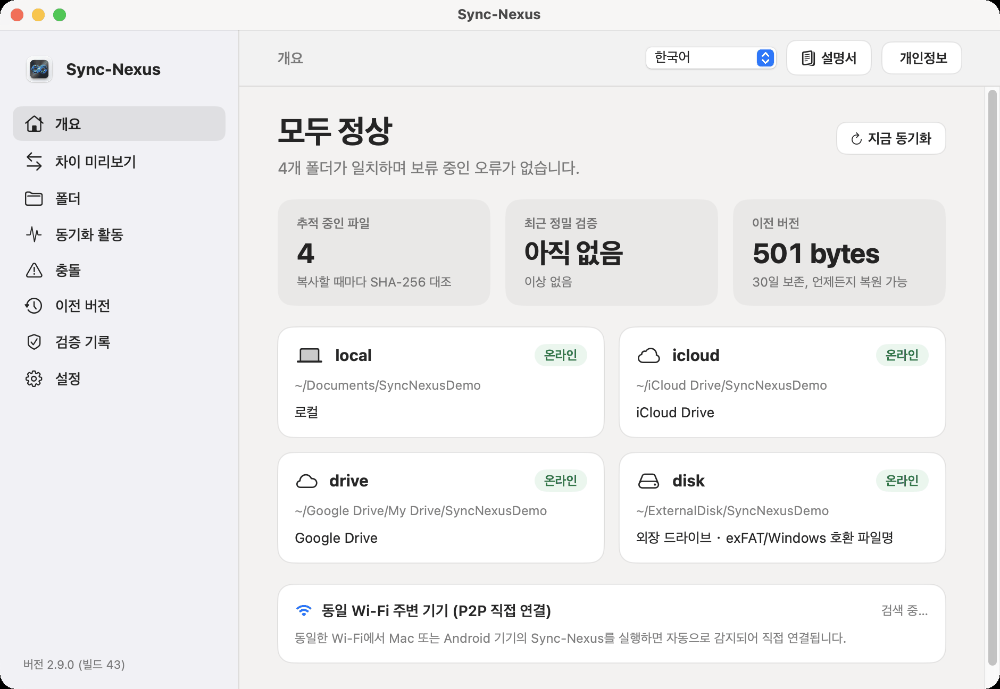
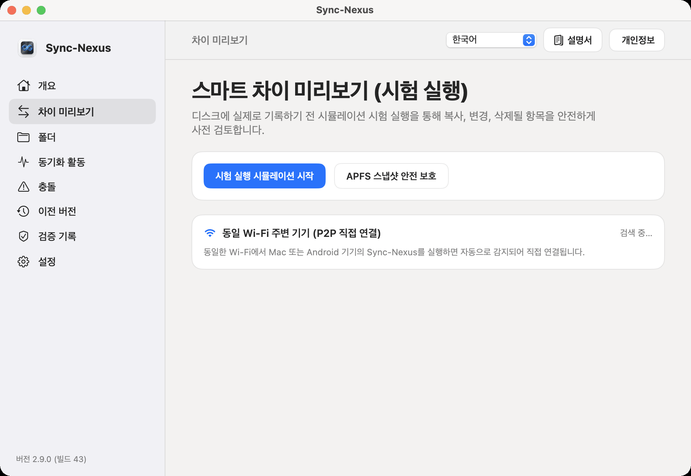
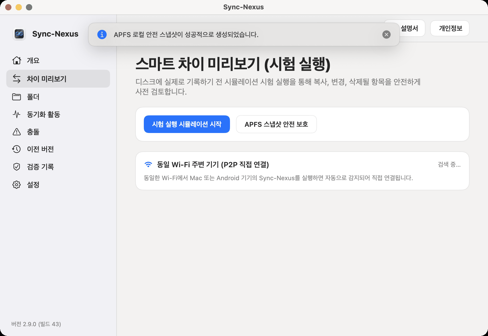
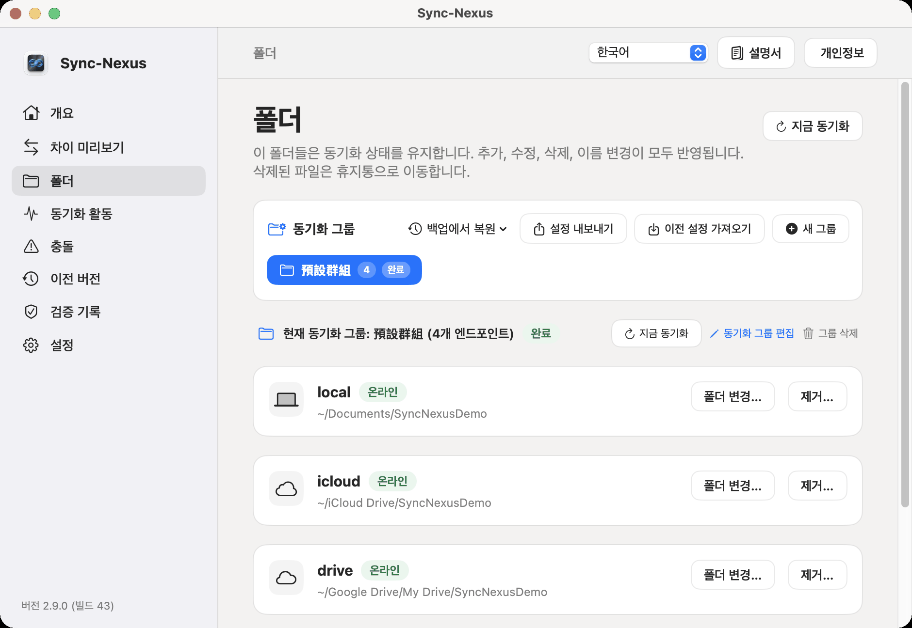
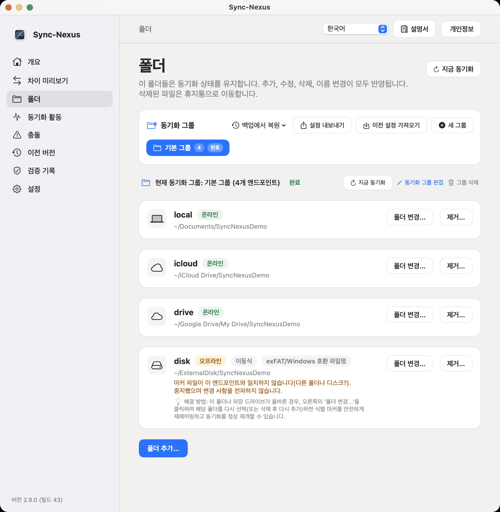
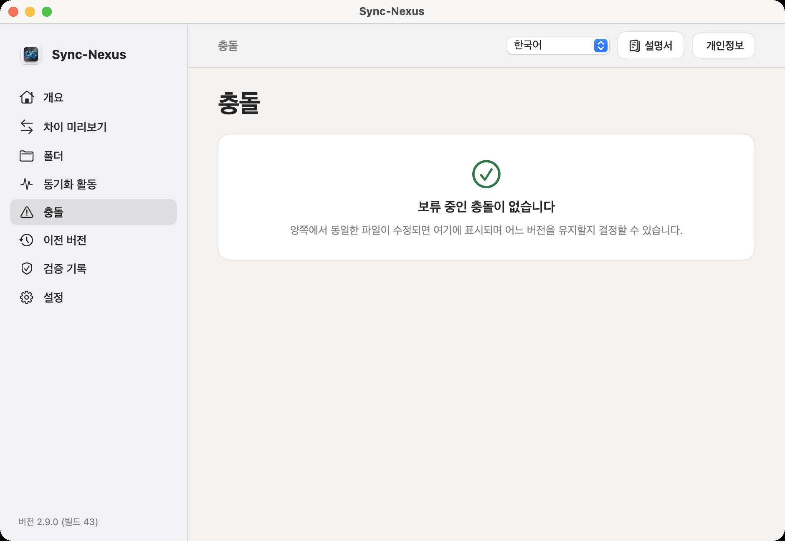
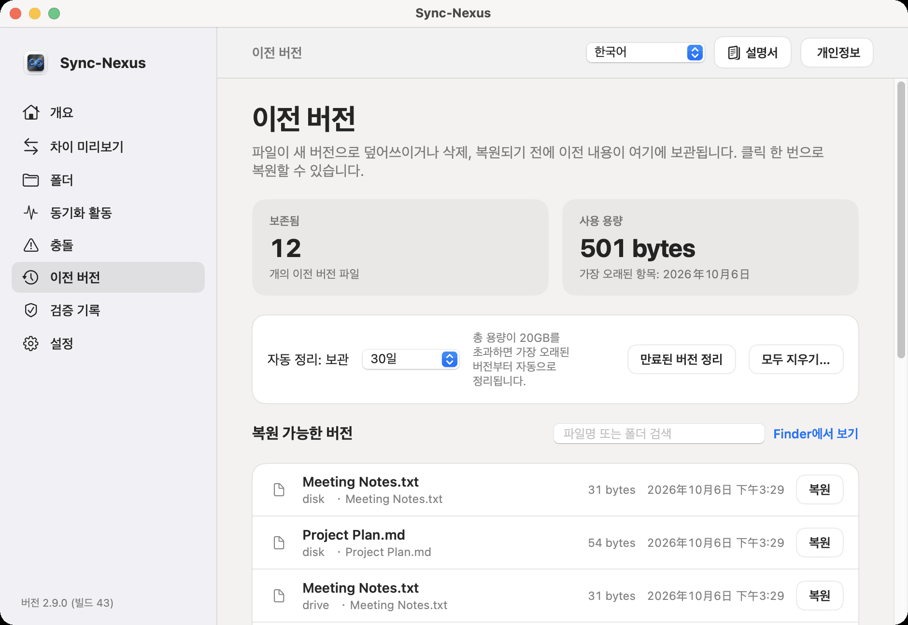
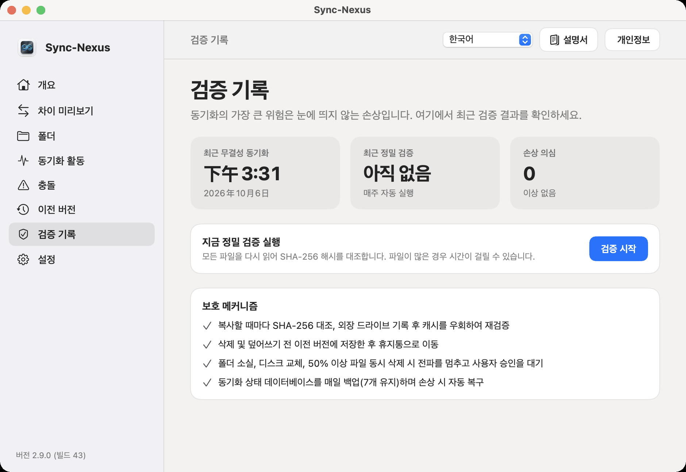
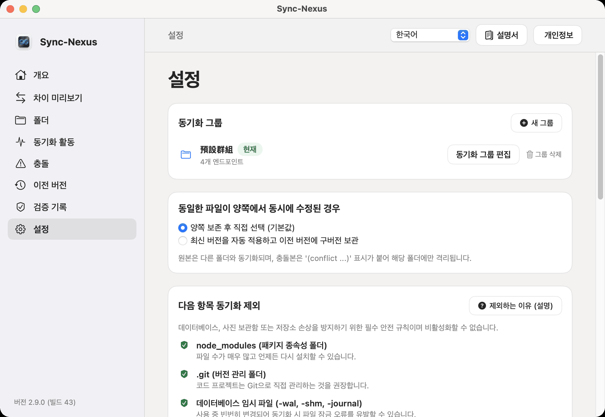

# SyncNexus 사용 설명서 — Apple (macOS) 종합 가이드

> **적용 플랫폼**：macOS 14.0 (Sonoma) 이상  
> **현재 버전**：1.2.0 (build 22)  
> **핵심 설계 원칙**：로컬 우선 (Local-First), 클라우드 서버 의존 제로 (Zero-Cloud), 절대적 데이터 보호 (Trash-First & History-Protected)

---

## 상단 내비게이션 바 기능 안내

메인 윈도우 최상단에는 전역 제어를 위한 상단 내비게이션 바가 배치되어 있습니다:

```
[ 현재 화면 제목 ] ------------------------- [ 언어 선택 드롭다운 ▾ ] [ 📖 설명서 ] [ 🛡️ 개인정보 보호 ]
```

1. **언어 전환 드롭다운 메뉴**:
   - **위치**: 헤더 우측 상단 첫 번째 컨트롤.
   - **기능 및 목적**: 6개 언어(번체 중국어, 간체 중국어, 영어, 일본어, 한국어, 태국어)를 즉시 전환.
   - **조작 방법**: 메뉴를 클릭하여 원하는 언어를 선택하면 재실행 없이 앱 전체 인터페이스가 즉시 변경됩니다.
2. **사용 설명서 버튼 (📖 아이콘)**:
   - **위치**: 언어 메뉴 우측.
   - **기능 및 목적**: 외부 브라우저 이동 없이 앱 내 네이티브 팝업 시트로 본 설명서를 직접 열람.
   - **조작 방법**: 클릭하여 열람하고, `Esc` 키 또는 '닫기' 버튼으로 작업 화면으로 복귀합니다.
3. **개인정보 보호정책 버튼 (🛡️ 아이콘)**:
   - **위치**: 설명서 버튼 우측.
   - **기능 및 목적**: SyncNexus의 로컬 동기화 및 샌드박스 데이터 보호 정책을 확인.

---

## 제1장: 개요 (Overview)



### 1.1 화면 위치 및 목적
'개요'는 SyncNexus의 **전체 건전성 대시보드**입니다. 개별 파일을 일일이 확인하지 않고도 시스템 전체의 동기화 상태, 추적 파일 수, 최근 검증 시간, 이전 버전 저장 공간 및 각 폴더 연결 상태를 한눈에 파악할 수 있습니다.

### 1.2 【초보자 가이드: 단계별 조작 절차】
- **【1단계: 상단 툴바 확인】**: 화면 우측 상단에 언어 메뉴, '사용 설명서 📖', '개인정보 보호 🛡️' 버튼이 항상 배치되어 있어 언제든 6개 언어 전환 및 설명서 열람이 가능합니다.
- **【2단계: 전체 상태 배지 확인】**: 좌측 상단의 배지를 확인하세요: 녹색 '모두 정상'은 완벽한 상태를 나타내며, 노란색 '경고'는 연결 끊김이나 충돌 등 주의가 필요함을 의미합니다.
- **【3단계: 대량 삭제 보호 대처】**: 한 번에 25개 이상 또는 25% 이상의 파일이 삭제되면 상단에 경고 카드가 나타나며 동기화가 일시 중단됩니다. 우측의 '검토 및 확인'을 클릭하여 허용할지 복원할지 결정하세요.
- **【4단계: 폴더 및 로컬 P2P 확인】**: 중앙에서 현재 그룹의 폴더 상태를 확인하고, 동일 Wi-Fi 내의 다른 기기는 하단 P2P 영역에 자동으로 '온라인' 직결 표시됩니다.

### 1.3 버튼 위치, 동작 현상 및 안전 보호

| 항목명 | 화면 실제 위치 | 목적 및 기능 | 조작 방법 | 동작 현상 및 안전 보호 |
| :--- | :--- | :--- | :--- | :--- |
| **전체 상태 배지** | 상단 제목 좌측 | 전체 동기화 건전성 상태 표시 | 상시 자동 모니터링 | 녹색 '모두 정상'; 문제 발생 시 노란색 '경고'로 전환. |
| **대량 삭제 보호 카드** | 제목 바로 아래 (이상 시에만) | 실수나 악성코드로 인한 대량 파일 손실 방지 | 우측 '**검토 및 확인**' 클릭 | 25개 이상 또는 25% 초과 삭제 시 자동 차단 및 중단. |
| **추적 파일 수 타일** | 지표 영역 1번째 | 동기화 추적 중인 전체 파일 수 표시 | 읽기 전용 | '실시간 SHA-256 추적' 표기, 파일 변경 시 즉시 갱신. |
| **최근 심층 검증 타일** | 지표 영역 2번째 | SHA-256 바이트 검증 실행 시간 | 읽기 전용 | '이상 없음' 또는 '손상 의심 X개' 경고 표시. |
| **이전 버전 용량 타일** | 지표 영역 3번째 | 히스토리 보관소가 사용하는 용량 및 기간 | 읽기 전용 | 예: '24.5 MB · 30일 보관, 언제든 복구 가능'. '이전 버전' 탭에서 관리. |
| **엔드포인트 카드** | 중앙 그리드 | 각 폴더의 상태 및 파일 시스템 특성 | 카드 정보 확인 | 녹색 '온라인', 노란색 '오프라인', 외장 드라이브는 'ExFAT / 이동식' 표시. |
| **로컬 P2P 직결 카드** | 하단 네트워크 영역 | 동일 Wi-Fi 내 SyncNexus 기기 자동 탐색 | 자동 탐색 | 발견된 기기명과 녹색 '온라인' 칩을 표시하며 P2P 직결 동기화 수행. |

### 1.4 일상 사용 팁
- 상단에 녹색 '모두 정상'이 표시되어 있다면 모든 폴더가 완벽히 동기화된 상태입니다. 일상 작업 중에는 별도의 수동 조작 없이 안심하고 작업하실 수 있습니다.

---

## 제2장: 차이 미리보기 (Diff Preview)



### 2.1 화면 위치 및 목적
실제 디스크에 쓰기 전에, **차이 미리보기**에서 안전한 **시뮬레이션 테스트(Dry-Run)**를 실행할 수 있습니다. 각 폴더 간의 복사, 이름 변경, 삭제 예정 항목을 색상별로 명확하게 확인한 후 적용할 수 있습니다.

### 2.2 【초보자 가이드: 단계별 조작 절차】
- **【1단계: 시뮬레이션 실행 클릭】**: 상단 좌측의 파란색 '시뮬레이션 실행' 버튼을 클릭하세요. 버튼이 '시뮬레이션 중...'으로 바뀌며 실제 파일 변경 없이 메모리에서만 차이를 계산합니다.
- **【2단계: APFS 스냅샷 생성 (선택 사항)】**: 대규모 동기화 전에 'APFS 스냅샷 보호'를 클릭하여 복원 지점을 생성할 수 있습니다. 샌드박스로 인해 불가한 경우 상단 토스트 알림으로 휴지통 및 버전 보관 기능이 안전하게 작동 중임을 안내합니다.
- **【3단계: 변경 목록 및 기호 확인】**: 계산이 끝나면 목록이 펼쳐집니다: 녹색 `+` (추가/복사), 파란색 `➔` (이름 변경), 빨간색 `−` (휴지통 이동). 차이가 없으면 녹색 체크표시 '모든 엔드포인트 일치'가 나타납니다.
- **【4단계: 동기화 확인 클릭】**: 내용을 확인한 후 우측 하단의 파란색 '동기화 확인' 버튼을 클릭하면 실제 파일 쓰기가 진행되고 상단 토스트 알림으로 완료를 알려줍니다.

### 2.3 버튼 위치, 동작 현상 및 안전 보호

| 버튼 / 항목명 | 화면 실제 위치 | 목적 및 기능 | 조작 방법 | 동작 현상 및 안전 보호 |
| :--- | :--- | :--- | :--- | :--- |
| **시뮬레이션 실행** | 상단 카드 좌측 (파란색 버튼) | 디스크 수정 없이 모든 차이를 메모리에서 대조 | 클릭하여 실행 | '시뮬레이션 중...'으로 바뀌고 하단에 예정 건수(예: '3개 항목 동기화 예정') 표시. |
| **동기화 확인** | 미리보기 목록 우측 하단 | 확인된 변경 사항을 각 폴더에 적용 | 클릭하여 확인 | 실제 동기화가 진행되며 상단에 완료 토스트 알림이 뜹니다. |
| **APFS 스냅샷 보호** | '시뮬레이션 실행' 우측 | 대규모 변경 전 시스템 복원 지점 생성 | 클릭하여 생성 | 성공 시 'APFS 스냅샷 생성됨', 권한 제한 시 상단 토스트 알림으로 보호 안내 (아래 그림). |



> **미리보기 기호 설명**:
> - 🟢 **`+` (녹색)**: 새로 추가되거나 다른 폴더에서 복사될 파일.
> - 🔵 **`➔` (파란색)**: 로컬에서 이름이 변경될 파일 (재다운로드 방지).
> - 🔴 **`−` (빨간색)**: 삭제 예정 파일 (**안전 보장: macOS 휴지통으로 우선 이동, 영구 삭제 절대 안 함**).

### 2.4 일상 사용 팁
- 중요한 대규모 프로젝트를 정리하거나 대량 파일을 삭제하기 전에, 먼저 '시뮬레이션 실행'을 클릭하여 변경 목록을 미리 확인하면 안전합니다.

---

## 제3장: 폴더 (Folders)



### 3.1 화면 위치 및 동기화 그룹 (Sync Groups)
'폴더'는 동기화 대상을 설정하는 곳입니다. SyncNexus는 **'동기화 그룹' 아키텍처 모델**을 채택하고 있습니다:
- **다중 작업 독립 동기화**: 여러 개의 독립된 동기화 그룹(업무 프로젝트, 가족 사진, 재무 관리 등)을 동시에 운영할 수 있습니다.
- **파이프라인 및 잠금 격리**: 각 그룹은 독립된 폴더 목록, SQLite DB, 감시 파이프라인 및 동기화 잠금을 가집니다. 한 그룹의 대용량 동기화가 다른 그룹을 지연시키지 않습니다.

### 3.2 【초보자 가이드: 단계별 조작 절차】
- **【1단계: 동기화 그룹 생성 및 전환】**:
  1. 상단의 '**＋ 새 그룹**'을 클릭하여 이름(예: 업무 프로젝트, 가족 사진)과 아이콘을 설정하세요.
  2. 그룹 칩을 클릭하여 원하는 그룹으로 즉시 전환합니다.
  3. '**✎ 동기화 그룹 편집**'에서 이름을 바꾸거나 안전하게 삭제할 수 있습니다 (실제 디스크 파일은 보존됨).
- **【2단계: 폴더 추가 클릭】**: 하단의 파란색 '**폴더 추가...**' 버튼을 클릭하여 Finder 선택 창을 엽니다 (그룹당 최소 2개 이상의 폴더가 필요합니다).
- **【3단계: 4대 저장 위치 선택 절차】**:
  1. **Mac 로컬**: Finder 실행 ➔ 사이드바 '문서' 또는 개인 폴더 ➔ 대상 폴더 선택.
  2. **iCloud Drive**: Finder 실행 ➔ 사이드바 'iCloud Drive' ➔ 대상 폴더 선택 (클라우드 파일 자동 다운로드 후 동기화).
  3. **Google Drive**: Finder 실행 ➔ 사이드바 'Google Drive' ➔ '내 드라이브' ➔ 대상 폴더 선택.
  4. **외장 USB 드라이브**: USB 연결 ➔ Finder 사이드바 '위치' 아래 드라이브 ➔ 대상 폴더 선택 (**ExFAT 포맷 권장**).
- **【4단계: 변경 및 해제】**: 경로 이동 시 '**폴더 변경...**'을 클릭하고, 동기화 해제 시 '**제거...**'를 클릭하세요 (실제 파일은 안전하게 보존됩니다).

### 3.3 버튼 위치, 동작 현상 및 마커 보호

| 버튼 / 항목명 | 화면 실제 위치 | 목적 및 기능 | 조작 방법 | 동작 현상 및 안전 보호 |
| :--- | :--- | :--- | :--- | :--- |
| **＋ 새 그룹** | 그룹 바 우측 | 새로운 다자간 동기화 그룹 생성 | 클릭 후 이름/아이콘 입력 | 새 탭이 추가되며 빈 상태로 전환. |
| **✎ 동기화 그룹 편집** | 현재 그룹 정보 우측 | 그룹 이름/아이콘 변경 또는 그룹 삭제 | 클릭하여 시트 열기 | 이름 변경 지원; 삭제 시 설정만 해제되며 파일은 유지. |
| **폴더 추가...** | 목록 하단 파란색 버튼 | 새 폴더를 동기화 네트워크에 연결 | 클릭하여 Finder에서 선택 | `.syncnexus-endpoint` UUID 마커를 생성하고 샌드박스 북마크 등록. |
| **폴더 변경...** | 각 카드 우측 첫 번째 버튼 | 경로 이동 시 재연결 | 클릭 후 새 경로 선택 | 마커 검증 후 자동 연결 복구. |
| **제거...** | 각 카드 우측 두 번째 버튼 | 동기화 목록에서 해제 | 클릭 후 확인 | 모니터링 목록에서만 제거되며, **실제 파일은 절대 삭제되지 않습니다**. |
| **마커 보호 기능** | 카드 상태 경고 영역 | 다른 USB 삽입으로 인한 덮어쓰기 방지 | 상시 자동 검증 | 다른 USB가 연결되면 '마커 불일치, 동기화 중단'(아래 그림)으로 자동 격리 보호! |



### 3.4 일상 사용 팁
- 외장 USB 드라이브를 ExFAT으로 포맷하면 SyncNexus의 호환 파일명 필터가 자동 작동하여 Mac과 Windows 간에 오류 없이 동기화됩니다.

---

## 제4장: 충돌 (Conflicts)



### 4.1 화면 위치 및 목적
오프라인 상태에서 두 장치에서 동일한 파일이 수정된 경우, SyncNexus는 **'덮어쓰기 제로' 원칙**을 지킵니다. 충돌 파일을 `파일명 (conflict ...)`으로 안전하게 보존하여 이 화면에서 나란히 비교하고 해결할 수 있습니다.

### 4.2 【초보자 가이드: 단계별 조작 절차】
- **【1단계: 사이드바 빨간색 충돌 배지 확인】**: 오프라인 상태에서 양쪽이 동시에 같은 파일을 수정하면 사이드바 '충돌' 아이콘에 빨간색 숫자 배지가 켜집니다. 클릭하여 화면으로 이동하세요.
- **【2단계: 좌우 나란히 버전 대조】**: 좌측은 '현재 기본 버전', 우측은 '엔드포인트 버전(녹색 최신 배지)'으로 파일 크기, 수정 일시, 출처 폴더가 상세히 표시됩니다.
- **【3단계: Finder에서 열어 내용 확인】**: 내용을 직접 비교하고 싶다면 카드 안의 'Finder에서 보기'를 클릭하여 텍스트 편집기 등으로 열어보세요.
- **【4단계: 중재 버튼 클릭】**:
  - 좌측 '**이 버전 유지**' 클릭: 기본 버전을 정식으로 채택하여 전파하고 충돌 사본은 안전 보관.
  - 우측 '**이 버전 사용**' 클릭: 충돌 사본을 기본 파일로 채택하고 기존 파일은 히스토리에 백업.
  - 해결 완료 시 배지가 사라지며 '미해결 충돌 없음'으로 전환됩니다.

### 4.3 버튼 위치, 동작 현상 및 해결 제어

| 버튼 / 항목명 | 화면 실제 위치 | 목적 및 기능 | 조작 방법 | 동작 현상 및 안전 보호 |
| :--- | :--- | :--- | :--- | :--- |
| **이 버전 유지** | 좌측 '현재 기본 버전' 카드 하단 | 기본 버전 채택 | 클릭 | 기본 파일이 유지되어 전파되고, 충돌 사본은 안전 보관. |
| **이 버전 사용** | 우측 카드 하단 (녹색 '최신' 태그) | 충돌 사본을 정식 파일로 채택 | 클릭 | 충돌 사본이 기본 파일이 되고, 이전 기본 파일은 '이전 버전'에 자동 백업. |
| **Finder에서 보기** | 양쪽 카드 내부에 배치 | macOS Finder에서 실제 파일 위치 열기 | 클릭 | Finder가 열리며 파일이 강조 표시되어 텍스트 편집기로 비교 가능. |
| **충돌 없음 상태** | 충돌이 없을 때 표시 | 미해결 충돌이 없음을 확인 | 읽기 전용 | 녹색 체크표시 '미해결 충돌이 없습니다' 표시. |

### 4.4 일상 사용 팁
- 두 버전의 변경 내용을 모두 반영해야 하는 경우, 먼저 'Finder에서 보기'를 클릭하여 텍스트 편집기에서 수동으로 병합한 후 '이 버전 유지'를 클릭하세요.

---

## 제5장: 이전 버전 (Versions)



### 5.1 화면 위치 및 목적
'이전 버전'은 파일 **타임머신**입니다. 파일이 수정되거나 동기화로 덮어씌워질 때마다 이전 내용이 `.syncnexus-history`에 안전하게 보관되어 언제든 클릭 한 번으로 이전 버전을 되살릴 수 있습니다.

### 5.2 【초보자 가이드: 단계별 조작 절차】
- **【1단계: 보관 기간 설정】**: 상단 카드의 '보관 기간' 메뉴에서 보관 기간(7일 / 30일 / 90일 / 영구 보관)을 선택하세요. 만료된 파일은 백그라운드에서 자동 정리됩니다.
- **【2단계: 대상 이전 파일 검색】**: 우측 상단 검색창에 파일명이나 폴더명을 입력하면 일치하는 과거 버전 목록이 즉시 필터링됩니다.
- **【3단계: 원클릭 복구】**: 목록 우측의 '**복구**' 버튼을 클릭하면 대상 파일이 즉시 해당 과거 버전으로 복원되며, 상단 성공 토스트 알림과 함께 2초 내에 모든 엔드포인트에 동기화됩니다.
- **【4단계: 수동 용량 정리 (선택 사항)】**: 디스크 공간이 부족하면 '**만료된 버전 정리**'를 클릭하거나, '**모두 지우기**'를 통해 확인 후 히스토리 전체를 비울 수 있습니다 (현재 작업 중인 파일에는 전혀 영향 없음).

### 5.3 버튼 위치, 동작 현상 및 히스토리 보호

| 버튼 / 항목명 | 화면 실제 위치 | 목적 및 기능 | 조작 방법 | 동작 현상 및 안전 보호 |
| :--- | :--- | :--- | :--- | :--- |
| **보관 기간 메뉴** | 상단 '자동 정리' 우측 | 이전 버전의 최대 디스크 보관 기간 설정 | 7일/30일/90일/영구 보관 선택 | 만료된 파일은 백그라운드에서 자동 삭제되어 공간 확보. |
| **만료된 버전 정리** | 보관 기간 우측 버튼 | 기한이 지난 이전 버전을 즉시 정리 | 클릭 | 만료 파일이 삭제되고 상단 사용량 숫자가 갱신됨. |
| **모두 지우기** | 정리 버튼 옆 | 히스토리 아카이브 전체 비우기 | 클릭 후 확인 | 과거 이력만 비우며, **현재 작업 중인 실제 파일에는 전혀 영향 없음**. |
| **검색창** | 목록 우측 상단 | 파일명이나 폴더명으로 빠른 필터링 | 키워드 입력 | 일치하는 파일만 즉시 필터링되어 목록에 표시. |
| **Finder에서 보기** | 검색창 우측 | `.syncnexus-history` 폴더를 Finder에서 열기 | 클릭 | 로컬 히스토리 보관 폴더를 직접 엽니다. |
| **복구 (Restore)** | 각 버전 항목 우측 | 선택한 버전을 작업 폴더로 복원 | '**복구**' 클릭 | 파일이 복원되고 2초 내에 모든 폴더에 동기화. |

### 5.4 일상 사용 팁
- 실수로 파일을 덮어쓰거나 잘못 수정한 경우, '이전 버전' 페이지에서 파일명을 검색하고 '복구'를 클릭하면 즉시 되살릴 수 있습니다!

---

## 제6장: 검증 기록 (Verification)



### 6.1 화면 위치 및 목적
하드디스크 불량 섹터로 인한 사일런트 비트 로트(Silent Bit-rot)나 네트워크 전송 오류를 방지하기 위해, 산업 표준 **SHA-256 해시**를 사용하여 모든 엔드포인트의 파일을 바이트 단위로 검증합니다.

### 6.2 【초보자 가이드: 단계별 조작 절차】
- **【1단계: 심층 무결성 검증 시작】**: 중앙 카드 우측의 파란색 '**지금 전체 검증 실행**' 버튼을 클릭하세요. 백그라운드에서 모든 엔드포인트 파일의 SHA-256 해시를 바이트 단위로 계산합니다.
- **【2단계: 검증 결과 보고서 확인】**: 완료 후 '최근 심층 검증' 시간이 갱신됩니다. 모두 일치하면 녹색 배지 '모두 정상, 이상 없음'이 표시되며 손상 파일이 발견되면 목록이 나타납니다.
- **【3단계: 손상 파일 복구】**:
  - '**다른 폴더에서 복구**' 클릭: 정상적인 폴더에서 깨끗한 원본을 복사하여 복구 (손상 파일은 먼저 히스토리에 보관).
  - '**현재 내용 수락**' 클릭: 의도적인 변경인 경우 기준 해시를 새로 계산하여 경고 해제.
- **【4단계: 4대 핵심 안전선 확인】**: 하단 카드에서 복사 시 해시 검증, 외장 재판독, 덮어쓰기 전 버전 보관, 대량 삭제 중단 보호선을 확인할 수 있습니다.

### 6.3 버튼 위치, 동작 현상 및 4대 안전 보호선

| 버튼 / 항목명 | 화면 실제 위치 | 목적 및 기능 | 조작 방법 | 동작 현상 및 안전 보호 |
| :--- | :--- | :--- | :--- | :--- |
| **지금 전체 검증 실행** | 중앙 카드 우측 (파란색 버튼) | 전체 파일 SHA-256 검증 시작 | 클릭하여 실행 | 백그라운드 계산 후 검증 일시와 이상 목록 갱신. |
| **다른 폴더에서 복구** | 이상 발견 시 표시 (파란색) | 정상 폴더에서 원본을 다운로드하여 복구 | 클릭하여 복구 | 정상 파일로 자동 덮어쓰며, 손상 파일은 히스토리에 보관. |
| **현재 내용 수락** | 이상 발견 시 표시 (흰색) | 현재 내용을 새 기준으로 승인 | 클릭하여 승인 | 기준 해시를 갱신하여 경고를 해제. |
| **안전 보호선 카드** | 화면 하단 카드 | 4대 내장 보호 구조 표시 | 읽기 전용 | 휴지통 우선, 마커 보호, 대량 삭제 차단, 실시간 SHA-256. |

### 6.4 일상 사용 팁
- 한 달에 한 번 정도 '지금 검증'을 클릭하여 모든 백업 하드디스크의 무결성을 점검하는 것을 권장합니다.

---

## 제7장: 설정 (Settings)



### 7.1 화면 위치 및 목적
'설정'에서는 충돌 해결 모드 선택, 임시 파일 제외 규칙, 자동 실행 설정 및 macOS 전체 디스크 접근 권한 안내를 제공합니다.

### 7.2 【초보자 가이드: 단계별 조작 절차】
- **【1단계: 충돌 처리 원칙 선택】**: 첫 번째 카드에서 '두 버전 모두 유지하고 수동 선택 (권장)' 또는 '새로운 버전 자동 채택' 중 선택하세요.
- **【2단계: 제외 규칙 스위치 설정】**: 두 번째 카드에서 `node_modules`, `.git`, 데이터베이스 잠금 파일(`-wal`, `-shm`), 사진 보관함(`.photoslibrary`) 제외 스위치를 켜거나 끕니다. 제외된 항목은 전송되지 않습니다.
- **【3단계: 언어 및 자동 실행 설정】**: 세 번째 카드에서 6개 언어 중 원하는 언어를 선택하고, '로그인 시 자동 실행' 스위치를 켜면 Mac 로그인 시 메뉴바에 자동 상주합니다.
- **【4단계: 전체 디스크 접근 권한 확인】**: 권한 카드에서 '권한 없음'으로 표시되면 '**시스템 설정 열기**'를 클릭하여 macOS '개인정보 보호 및 보안 ➔ 전체 디스크 접근 권한'에서 SyncNexus를 허용하세요. '**로그 파일 열기**'로 진단 로그도 확인할 수 있습니다.

### 7.3 버튼 위치, 동작 현상 및 환경설정

| 설정 항목 | 화면 실제 위치 | 목적 및 기능 | 옵션 및 조작 방법 | 동작 현상 및 안전 보호 |
| :--- | :--- | :--- | :--- | :--- |
| **충돌 처리 원칙** | 첫 번째 카드 | 동시 편집 시 기본 동작 설정 | 라디오 선택:<br>1. **두 버전 모두 유지하고 수동 선택** (권장)<br>2. **새로운 버전 자동 채택** | 1번은 충돌 사본을 생성하여 '충돌' 탭에 보관; 2번은 최신 시간 기준으로 자동 덮어쓰기. |
| **제외 규칙 스위치** | 2번째 카드 | 불필요한 시스템 임시 파일 제외 | 개별 스위치:<br>• `node_modules`<br>• `.git`<br>• DB 잠금 파일 (`-wal`, `-shm`)<br>• 사진 (`.photoslibrary`) | 활성화 시 해당 파일은 동기화 대상에서 제외되어 대역폭과 디스크 부담 절약. |
| **인터페이스 언어** | 3번째 카드 상단 | 앱 표시 언어 설정 | 6개 언어 중 선택 | 앱 전체 언어가 즉시 변경됨. |
| **로그인 시 자동 실행** | 언어 설정 아래 | Mac 로그인 시 자동 시작 여부 | 스위치 켜기/끄기 | 켜두면 메뉴바에서 백그라운드로 대기하며 상시 동기화 유지. |
| **디스크 접근 권한** | 권한 카드 | 파일시스템 접근 권한 확인 | 녹색 '권한 있음' / 노란색 '권한 없음' | 미인가 시 '**시스템 설정 열기**'를 눌러 macOS 설정에서 권한 허용. |
| **로그 파일 열기** | 화면 좌측 하단 버튼 | 실시간 진단 로그 열람 | 클릭 | 콘솔 또는 텍스트 편집기로 로그 파일 열림. |
| **사용 설명 가이드** | 로그 버튼 옆 | 초기 환영 가이드 다시 보기 | 클릭 | 온보딩 가이드 팝업 실행. |


### 7.4 일상 사용 팁
- 개발자의 경우 `node_modules` 제외 스위치를 켜두는 것을 강력히 권장합니다. 수만 개의 자잘한 파일 전송을 건너뛰어 동기화 속도가 비약적으로 향상됩니다.

---

## 요약: 일상 안심 사용 원칙

1. **별도 조작 없이 편안한 작업**: 폴더가 '온라인' 상태라면 파일을 저장하거나 수정하는 즉시 2초 내에 모든 폴더에 자동 동기화됩니다.
2. **의심스러울 때는 먼저 시뮬레이션**: 대량 파일 이동이나 정리 전에는 '차이 미리보기'에서 '시뮬레이션 실행'을 먼저 눌러보세요.
3. **파일을 실수로 지웠어도 안심**: 먼저 휴지통을 확인하고, 휴지통을 비웠더라도 '이전 버전' 화면에서 '복구'를 누르면 언제든 되살릴 수 있습니다!
