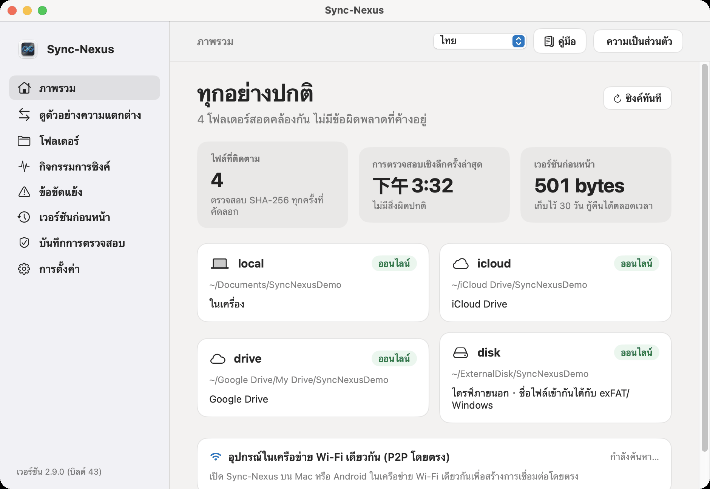
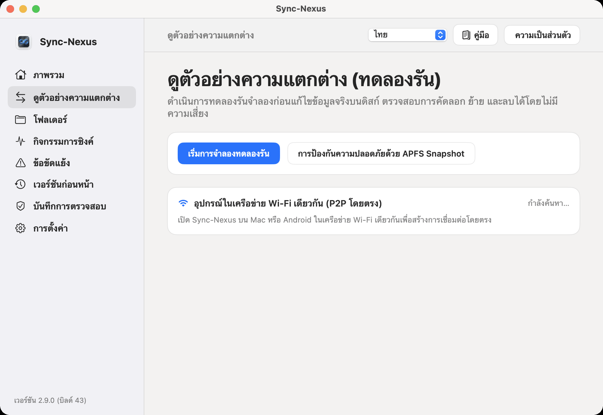
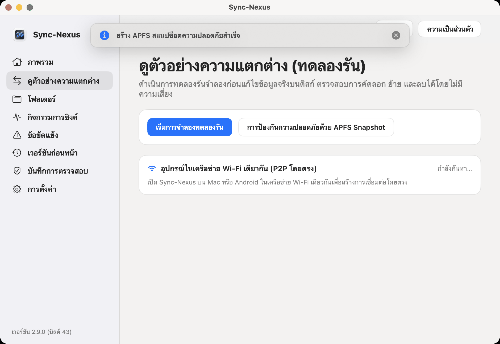
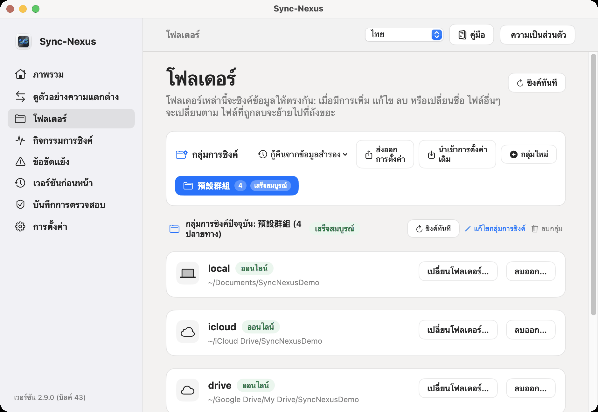
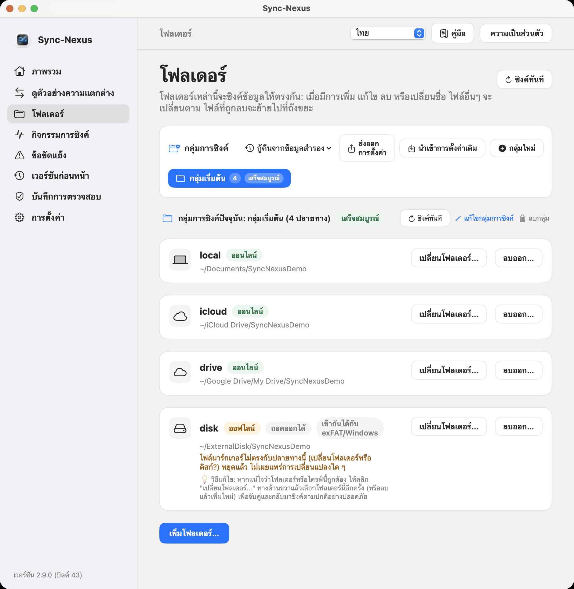
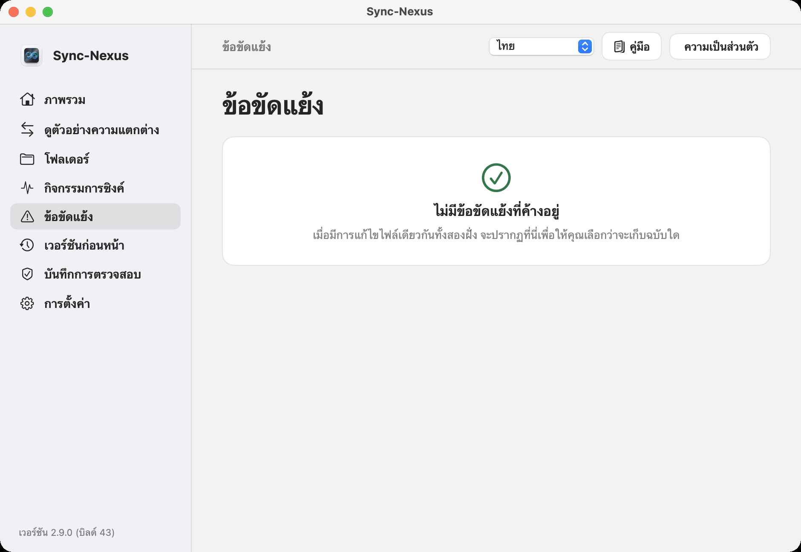
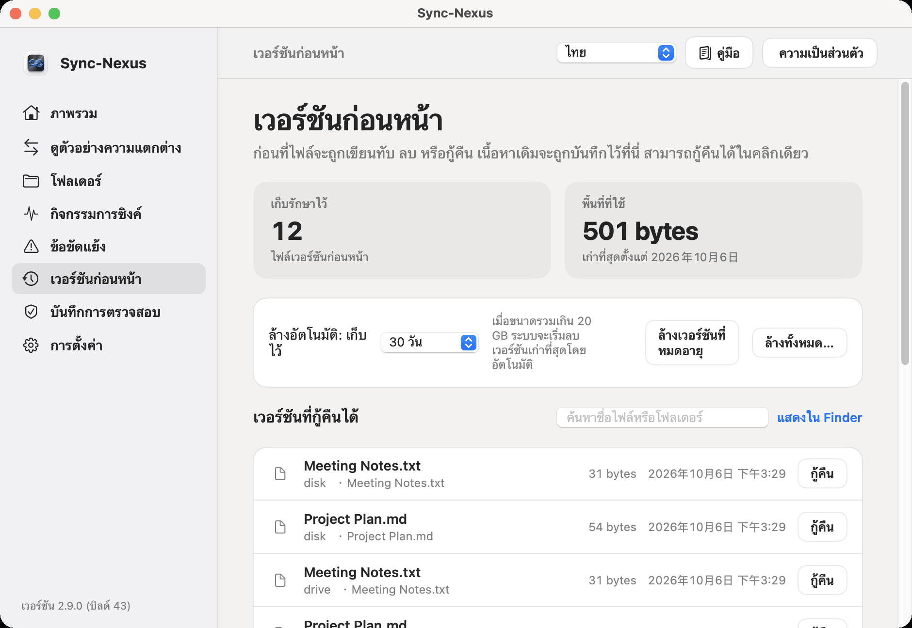
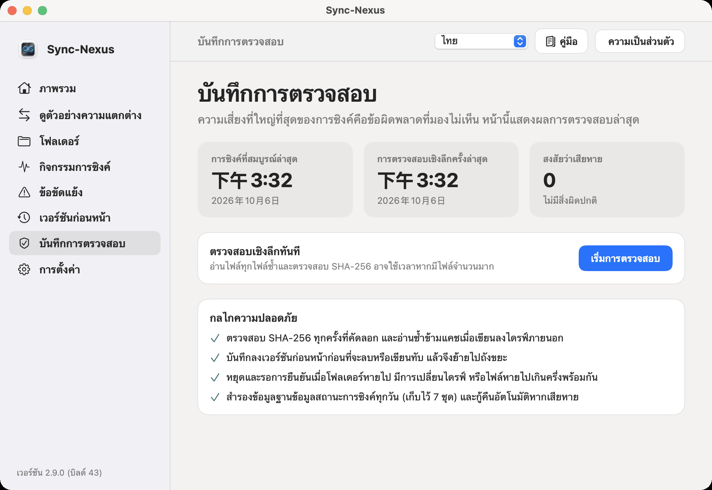
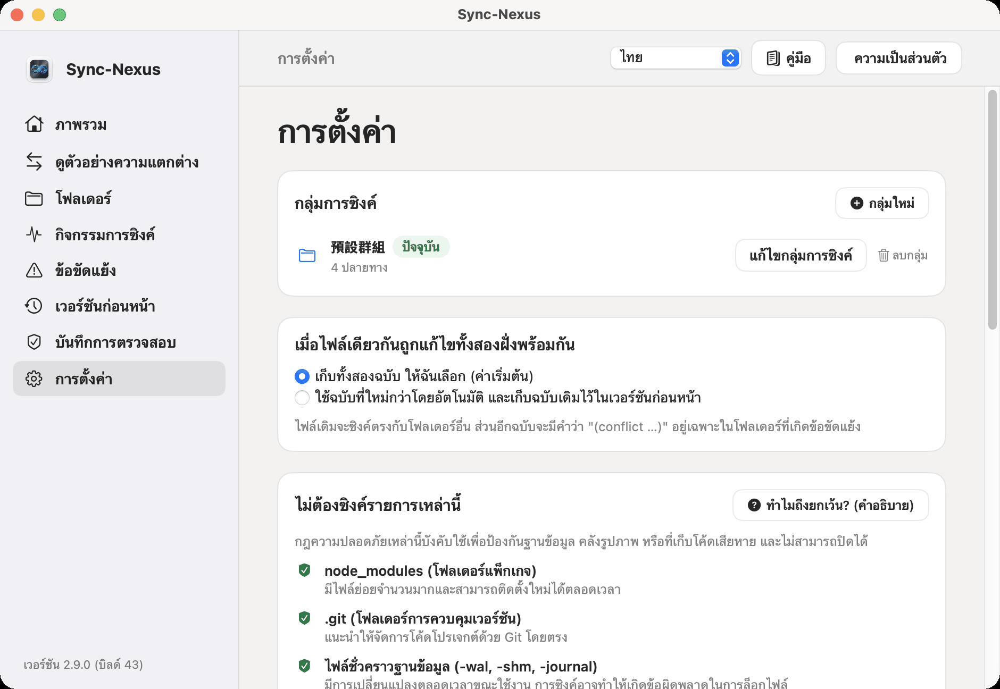

# คู่มือการใช้งาน SyncNexus — คู่มือฉบับสมบูรณ์สำหรับ Apple (macOS)

> **แพลตฟอร์มที่รองรับ**: macOS 14.0 (Sonoma) ขึ้นไป  
> **เวอร์ชันปัจจุบัน**: 1.2.0 (build 22)  
> **หลักการออกแบบสำคัญ**: ทำงานบนเครื่องเป็นหลัก (Local-First), ไม่ผูกมัดกับคลาวด์เซิร์ฟเวอร์ (Zero-Cloud), ปกป้องข้อมูลปลอดภัยสูงสุด (Trash-First & History-Protected)

---

## ฟังก์ชันแถบเครื่องมือด้านบน

ด้านบนสุดของหน้าต่างหลัก มีแถบเครื่องมือส่วนกลางสำหรับการควบคุมดังนี้:

```
[ ชื่อหน้าปัจจุบัน ] ------------------------- [ เมนูเลือกภาษา ▾ ] [ 📖 คู่มือการใช้งาน ] [ 🛡️ นโยบายความเป็นส่วนตัว ]
```

1. **เมนูเลือกภาษา (Dropdown)**:
   - **ตำแหน่ง**: มุมขวาบนของแถบเครื่องมือ
   - **หน้าที่**: สลับภาษาได้ทันที 6 ภาษา (จีนตัวเต็ม, จีนตัวย่อ, อังกฤษ, ญี่ปุ่น, เกาหลี, ไทย)
   - **วิธีใช้งาน**: คลิกเพื่อเปิดเมนูแล้วเลือกภาษาที่ต้องการ ทั้งแอปพลิเคชันจะเปลี่ยนภาษาทันทีโดยไม่ต้องรีสตาร์ต
2. **ปุ่มคู่มือการใช้งาน (ไอคอน 📖)**:
   - **ตำแหน่ง**: ด้านขวาของเมนูภาษา
   - **หน้าที่**: เปิดอ่านคู่มือนี้ในหน้าต่างแอปโดยตรง ไม่ต้องเชื่อมต่ออินเทอร์เน็ต และไม่เปิดไปยังหน้าเว็บภายนอก
   - **วิธีใช้งาน**: คลิกเพื่อเปิดอ่าน กด `Esc` หรือปุ่ม "ปิด" เพื่อกลับสู่หน้าทำงานเดิม
3. **ปุ่มนโยบายความเป็นส่วนตัว (ไอคอน 🛡️)**:
   - **ตำแหน่ง**: ด้านขวาของปุ่มคู่มือ
   - **หน้าที่**: แสดงข้อผูกพันความปลอดภัยของ SyncNexus ในการทำงานแบบออฟไลน์บนเครื่องของคุณ

---

## บทที่ 1: ภาพรวม (Overview)



### 1.1 หน้าที่และวัตถุประสงค์
หน้า "ภาพรวม" คือ**แดชบอร์ดสถานะสุขภาพของทั้งระบบ** ช่วยให้คุณตรวจสอบความพร้อมของระบบซิงค์ไฟล์ได้ทันทีโดยไม่ต้องตรวจทีละไฟล์ ดูจำนวนไฟล์ทั้งหมด เวลาตรวจสอบความสมบูรณ์ล่าสุด พื้นที่ประวัติ และสถานะของทุกโฟลเดอร์

### 1.2 【คู่มือเริ่มต้น: ขั้นตอนการใช้งานทีละขั้นตอน】
- **【ขั้นตอนที่ 1: แถบเครื่องมือด้านบน】**: มุมขวาบนมีเมนูภาษา ปุ่ม "คู่มือ 📖" และ "ความเป็นส่วนตัว 🛡️" คลิกเพื่อสลับภาษาหรือเปิดคู่มือได้ตลอดเวลา
- **【ขั้นตอนที่ 2: ตรวจสอบสถานะโดยรวม】**: ดูที่ป้ายซ้ายบน: สีเขียว "ปกติทั้งหมด" หมายถึงระบบพร้อมสมบูรณ์ หากเป็นสีเหลือง "คำเตือน" หมายถึงมีโฟลเดอร์ออฟไลน์หรือมีข้อขัดแย้ง
- **【ขั้นตอนที่ 3: รับมือกับการป้องกันการลบจำนวนมาก】**: หากมีการลบไฟล์ >25 ไฟล์หรือ >25% พร้อมกัน แถบเตือนจะปรากฏและหยุดการซิงค์ไว้ชั่วคราว คลิก "ตรวจสอบและยืนยัน" ทางขวาเพื่อเลือกว่าจะอนุญาตหรือกู้คืน
- **【ขั้นตอนที่ 4: ตรวจสอบโฟลเดอร์และ P2P】**: ส่วนกลางแสดงสถานะโฟลเดอร์ทั้งหมดในกลุ่มปัจจุบัน และอุปกรณ์ใน Wi-Fi เดียวกันจะแสดงในส่วน P2P ด้านล่างโดยอัตโนมัติ

### 1.3 ตำแหน่งปุ่ม ผลลัพธ์การทำงาน และระบบความปลอดภัย

| รายการ | ตำแหน่งบนหน้าจอ | หน้าที่และวัตถุประสงค์ | วิธีใช้งาน | ผลลัพธ์และการป้องกัน |
| :--- | :--- | :--- | :--- | :--- |
| **ไฟสถานะโดยรวม** | ด้านซ้ายของชื่อเรื่องบนสุด | แสดงสุขภาพการซิงค์ไฟล์ทั้งหมด | ตรวจสอบอัตโนมัติ | สีเขียว "ปกติทั้งหมด"; หากมีโฟลเดอร์หลุดหรือขัดแย้งจะเปลี่ยนเป็นสีเหลือง "คำเตือน" |
| **บัตรการลบจำนวนมาก** | ใต้ชื่อเรื่อง (แสดงเมื่อผิดปกติ) | ป้องกันไฟล์หายจากความผิดพลาดหรือมัลแวร์ | คลิก "**ตรวจสอบและยืนยัน**" | หยุดการซิงค์ทันทีเมื่อลบ >25 ไฟล์หรือ >25% จนกว่าจะได้รับการยืนยัน |
| **ไฟล์ที่ติดตาม** | กล่องข้อมูลที่ 1 | แสดงจำนวนไฟล์ทั้งหมดที่อยู่ในการซิงค์ | ดูอย่างเดียว | ระบุ "ติดตาม SHA-256 แบบเรียลไทม์" ตัวเลขจะอัปเดตทันทีเมื่อไฟล์เปลี่ยน |
| **การตรวจสอบล่าสุด** | กล่องข้อมูลที่ 2 | เวลาที่ทำการตรวจสอบ SHA-256 ล่าสุด | ดูอย่างเดียว | แสดง "ไม่มีสิ่งผิดปกติ" หรือ "พบไฟล์เสียหาย X ไฟล์" |
| **พื้นที่เวอร์ชันเก่า** | กล่องข้อมูลที่ 3 | พื้นที่ดิสก์ที่ใช้เก็บประวัติไฟล์ | ดูอย่างเดียว | แสดง เช่น "24.5 MB · เก็บไว้ 30 วัน กู้คืนได้เสมอ" จัดการได้ที่แท็บ "เวอร์ชันเก่า" |
| **การ์ดสถานะโฟลเดอร์** | พื้นที่ตารางตรงกลาง | แสดงสถานะ เส้นทาง และรูปแบบไดรฟ์ | ดูข้อมูลบนการ์ด | ป้ายเขียว "ออนไลน์", เหลือง "ออฟไลน์", ไดรฟ์ภายนอกจะแสดง "ExFAT / ถอดออกได้" |
| **เชื่อมต่อ P2P ในเครือข่าย** | พื้นที่เครือข่ายด้านล่าง | ค้นหาอุปกรณ์ Mac หรือ Android บน Wi-Fi เดียวกัน | ค้นหาอัตโนมัติ | แสดงชื่ออุปกรณ์ที่พบพร้อมป้ายเขียว "ออนไลน์" เพื่อส่งไฟล์โดยตรง |

### 1.4 เคล็ดลับการใช้งานประจำวัน
- ตราบใดที่ไฟด้านบนแสดงสีเขียว "ปกติทั้งหมด" หมายความว่าทุกโฟลเดอร์ตรงกันอย่างสมบูรณ์ คุณสามารถทำงานได้โดยไม่ต้องกังวลหรือกดปุ่มใดๆ

---

## บทที่ 2: ตัวอย่างความแตกต่าง (Diff Preview)



### 2.1 หน้าที่และวัตถุประสงค์
ก่อนที่จะเขียนไฟล์ลงดิสก์ **ตัวอย่างความแตกต่าง** ให้คุณ**จำลองการซิงค์ (Dry-Run)** โดยไม่มีความเสี่ยง ช่วยให้คุณตรวจสอบรายการไฟล์ที่จะคัดลอก เปลี่ยนชื่อ หรือลบก่อนที่จะดำเนินการจริง

### 2.2 【คู่มือเริ่มต้น: ขั้นตอนการใช้งานทีละขั้นตอน】
- **【ขั้นตอนที่ 1: คลิกดำเนินการจำลอง】**: คลิกปุ่มสีน้ำเงิน "ดำเนินการจำลอง" ซ้ายบน ปุ่มจะเปลี่ยนเป็น "กำลังจำลอง..." เพื่อคำนวณความแตกต่างโดยไม่แก้ไขไฟล์จริงในดิสก์
- **【ขั้นตอนที่ 2: สร้างสแนปช็อต APFS (ทางเลือก)】**: คลิก "การป้องกันด้วยสแนปช็อต APFS" เพื่อสร้างจุดคืนค่า หากระบบไม่อนุญาต จะมี Toast แจ้งว่าถังขยะและประวัติจะทำหน้าที่สำรองข้อมูลแทนอย่างปลอดภัย
- **【ขั้นตอนที่ 3: ตรวจสอบรายการและสัญลักษณ์】**: รายการเปลี่ยนแปลงจะปรากฏ: สีเขียว `+` (เพิ่ม/คัดลอก), สีน้ำเงิน `➔` (เปลี่ยนชื่อ), สีแดง `−` (ลบลงถังขยะ) หากไม่มีความแตกต่างจะแสดงเครื่องหมายถูกสีเขียว
- **【ขั้นตอนที่ 4: กดยืนยันและซิงค์】**: เมื่อตรวจสอบเรียบร้อยแล้ว ให้คลิกปุ่ม "ยืนยันและซิงค์" ที่มุมขวาล่าง ข้อมูลจะถูกเขียนลงทุกโฟลเดอร์พร้อมข้อความแจ้งเตือนสำเร็จ

### 2.3 ตำแหน่งปุ่ม ผลลัพธ์การทำงาน และระบบความปลอดภัย

| ปุ่ม / รายการ | ตำแหน่งบนหน้าจอ | หน้าที่และวัตถุประสงค์ | วิธีใช้งาน | ผลลัพธ์และการป้องกัน |
| :--- | :--- | :--- | :--- | :--- |
| **ดำเนินการจำลอง** | มุมซ้ายบนของการ์ดหลัก (ปุ่มน้ำเงิน) | คำนวณความแตกต่างในหน่วยความจำโดยไม่แตะต้องดิสก์ | คลิกเพื่อเริ่ม | เปลี่ยนเป็น "กำลังจำลอง..." และแสดงรายการการซิงค์ด้านล่าง |
| **ยืนยันและซิงค์** | มุมขวาล่างของรายการ | ดำเนินการเขียนไฟล์จริงตามที่ตรวจสอบแล้ว | คลิกเพื่อยืนยัน | ระบบจะเริ่มซิงค์ไฟล์จริง และแสดง Toast แจ้งเตือนสำเร็จด้านบน |
| **สแนปช็อต APFS** | ด้านขวาของปุ่มดำเนินการจำลอง | สร้างจุดคืนค่าระบบของ macOS ก่อนซิงค์ใหญ่ | คลิกเพื่อสร้าง | เมื่อสำเร็จจะแจ้ง "สร้างสแนปช็อตแล้ว" หากทำไม่ได้จะมี Toast แจ้งเตือน (ภาพด้านล่าง) |



> **ความหมายของสัญลักษณ์**:
> - 🟢 **`+` (สีเขียว)**: ไฟล์ที่จะเพิ่มหรือคัดลอกจากโฟลเดอร์อื่น
> - 🔵 **`➔` (สีน้ำเงิน)**: ไฟล์ที่จะเปลี่ยนชื่อในเครื่อง (ไม่ต้องดาวน์โหลดซ้ำ)
> - 🔴 **`−` (สีแดง)**: ไฟล์ที่จะถูกลบ (**รับประกันความปลอดภัย: ย้ายลงถังขยะ macOS ก่อนเสมอ ไม่ลบถาวรทันที**)

### 2.4 เคล็ดลับการใช้งานประจำวัน
- ก่อนจัดระเบียบโปรเจกต์ใหญ่หรือลบไฟล์จำนวนมาก ให้คลิก "ดำเนินการจำลอง" เพื่อตรวจสอบรายการให้มั่นใจก่อนซิงค์จริง

---

## บทที่ 3: โฟลเดอร์ (Folders)



### 3.1 หน้าที่และกลุ่มการซิงค์ (Sync Groups)
แท็บ "โฟลเดอร์" ใช้สำหรับจัดการโฟลเดอร์ปลายทาง SyncNexus ใช้สถาปัตยกรรม**กลุ่มการซิงค์ (Sync Groups)**:
- **จัดการได้หลายงานพร้อมกัน**: สร้างกลุ่มการซิงค์แยกอิสระได้หลายกลุ่ม (เช่น งาน, รูปถ่าย, การเงิน)
- **แยกการทำงานอิสระ**: แต่ละกลุ่มมีโฟลเดอร์ ฐานข้อมูล SQLite และระบบตรวจจับการเปลี่ยนแปลงของตัวเอง การซิงค์ไฟล์ขนาดใหญ่ในกลุ่ม A จะไม่กระทบไฟล์ในกลุ่ม B

### 3.2 【คู่มือเริ่มต้น: ขั้นตอนการใช้งานทีละขั้นตอน】
- **【ขั้นตอนที่ 1: สร้างและสลับกลุ่มการซิงค์】**:
  1. คลิก "**＋ กลุ่มใหม่**" ด้านบน ตั้งชื่อ (เช่น งาน, รูปถ่าย) และเลือกไอคอน
  2. คลิกแท็บกลุ่มเพื่อสลับโฟลเดอร์ที่แสดงด้านล่าง
  3. คลิก "**✎ แก้ไขกลุ่ม**" เพื่อเปลี่ยนชื่อหรือลบกลุ่ม (ไฟล์จริงในดิสก์จะไม่ถูกลบ)
- **【ขั้นตอนที่ 2: คลิกเพิ่มโฟลเดอร์...】**: คลิกปุ่มสีน้ำเงิน "**เพิ่มโฟลเดอร์...**" ด้านล่างเพื่อเปิดหน้าต่างเลือกของ Finder (แต่ละกลุ่มต้องมีอย่างน้อย 2 โฟลเดอร์เพื่อซิงค์ข้อมูล)
- **【ขั้นตอนที่ 3: เลือกจาก 4 แหล่งข้อมูล】**:
  1. **เครื่อง Mac**: เปิด Finder ➔ คลิก "Documents" ในแถบด้านข้าง ➔ เลือกโฟลเดอร์เป้าหมาย
  2. **iCloud Drive**: เปิด Finder ➔ คลิก "iCloud Drive" ในแถบด้านข้าง ➔ เลือกโฟลเดอร์เป้าหมาย (ระบบจะดาวน์โหลดไฟล์คลาวด์มาซิงค์ให้อัตโนมัติ)
  3. **Google Drive**: เปิด Finder ➔ คลิก "Google Drive" ➔ "My Drive" ➔ เลือกโฟลเดอร์
  4. **แฟลชไดรฟ์ USB**: เสียบแฟลชไดรฟ์ ➔ เปิด Finder ➔ คลิกชื่อไดรฟ์ใต้ "Locations" ➔ เลือกโฟลเดอร์ (**แนะนำฟอร์แมตเป็น ExFAT**)
- **【ขั้นตอนที่ 4: เปลี่ยนหรือลบโฟลเดอร์】**: หากย้ายที่อยู่ให้คลิก "**เปลี่ยนโฟลเดอร์...**" หรือคลิก "**ลบ...**" เพื่อยกเลิกการซิงค์ (ไม่ลบไฟล์จริง)

### 3.3 ตำแหน่งปุ่ม ผลลัพธ์การทำงาน และการป้องกันมาร์กเกอร์

| ปุ่ม / รายการ | ตำแหน่งบนหน้าจอ | หน้าที่และวัตถุประสงค์ | วิธีใช้งาน | ผลลัพธ์และการป้องกัน |
| :--- | :--- | :--- | :--- | :--- |
| **＋ กลุ่มใหม่** | แถบกลุ่มด้านบนขวา | สร้างกลุ่มการซิงค์ใหม่ | คลิกแล้วตั้งชื่อ/ไอคอน | เพิ่มแท็บกลุ่มใหม่และสลับไปยังกลุ่มว่าง |
| **✎ แก้ไขกลุ่ม** | ด้านขวาของข้อมูลกลุ่ม | เปลี่ยนชื่อ ไอคอน หรือลบกลุ่ม | คลิกเพื่อแก้ไข | การลบกลุ่มจะยกเลิกการซิงค์เท่านั้น ไฟล์จริงในเครื่องยังคงอยู่ |
| **เพิ่มโฟลเดอร์...** | ปุ่มสีน้ำเงินด้านล่าง | นำโฟลเดอร์เข้าสู่การซิงค์ | คลิกและเลือกใน Finder | สร้างไฟล์ `.syncnexus-endpoint` UUID และบันทึกสิทธิ์ App Sandbox |
| **เปลี่ยนโฟลเดอร์...** | ปุ่มแรกทางขวาของการ์ด | เชื่อมโยงเส้นทางใหม่เมื่อโฟลเดอร์ถูกย้าย | คลิกและเลือกที่อยู่ใหม่ | ตรวจสอบมาร์กเกอร์แล้วกลับมาซิงค์อัตโนมัติ |
| **ลบ...** | ปุ่มที่สองทางขวาของการ์ด | ยกเลิกการซิงค์โฟลเดอร์ | คลิกแล้วกดยืนยัน | ยกเลิกการติดตามเท่านั้น **ไม่ลบไฟล์จริงในเครื่องโดยเด็ดขาด** |
| **การป้องกันมาร์กเกอร์** | พื้นที่สถานะบนการ์ด | ป้องกันการเสียบแฟลชไดรฟ์ผิดตัว | ตรวจสอบอัตโนมัติ | หากเสียบผิดตัวจะขึ้น "มาร์กเกอร์ไม่ตรง หยุดการซิงค์" (ภาพล่าง) เพื่อแยกความปลอดภัย! |



### 3.4 เคล็ดลับการใช้งานประจำวัน
- การฟอร์แมตแฟลชไดรฟ์เป็น ExFAT จะเปิดใช้งานตัวกรองชื่อไฟล์ที่เข้ากันได้กับ Windows โดยอัตโนมัติ ป้องกันปัญหาชื่อไฟล์ข้ามระบบ

---

## บทที่ 4: ข้อขัดแย้ง (Conflicts)



### 4.1 หน้าที่และวัตถุประสงค์
เมื่อไฟล์ถูกแก้ไขพร้อมกันในสองเครื่องขณะออฟไลน์ SyncNexus จะยึดหลัก**ไม่เขียนทับฝ่ายใดทั้งสิ้น** ระบบจะเก็บสำเนาข้อขัดแย้งไว้เป็น `ชื่อไฟล์ (conflict ...)` ให้คุณเปรียบเทียบและเลือกเวอร์ชันที่ต้องการในหน้านี้

### 4.2 【คู่มือเริ่มต้น: ขั้นตอนการใช้งานทีละขั้นตอน】
- **【ขั้นตอนที่ 1: ตรวจสอบป้ายตัวเลขสีแดง】**: เมื่อมีการแก้ไขพร้อมกันขณะออฟไลน์ ตัวเลขสีแดงจะแสดงบนแท็บ "ข้อขัดแย้ง" ให้คลิกเพื่อเข้าสู่หน้าจัดการ
- **【ขั้นตอนที่ 2: เปรียบเทียบสองเวอร์ชันซ้ายขวา】**: หน้าจอแสดงการเปรียบเทียบ: ทางซ้ายคือ "เวอร์ชันหลักปัจจุบัน" ทางขวาคือ "เวอร์ชันจากโฟลเดอร์" (มีป้ายสีเขียว "ใหม่กว่า") แสดงขนาด วันที่แก้ไข และแหล่งที่มา
- **【ขั้นตอนที่ 3: เปิดใน Finder เพื่อดูเนื้อหา】**: หากต้องการตรวจดูเนื้อหาภายในไฟล์ ให้คลิก "แสดงใน Finder" บนการ์ดเพื่อเปิดดูไฟล์ในโปรแกรมแก้ไขข้อความ
- **【ขั้นตอนที่ 4: คลิกปุ่มตัดสิน】**:
  - คลิกซ้าย "**เก็บเวอร์ชันนี้**": ยึดเวอร์ชันหลักและซิงค์ไปยังทุกโฟลเดอร์ สำเนาขัดแย้งจะถูกเก็บถาวร
  - คลิกขวา "**ใช้เวอร์ชันนี้**": นำสำเนาขัดแย้งมาใช้แทน โดยเวอร์ชันเดิมจะถูกสำรองไว้ในประวัติ
  - เมื่อเสร็จสิ้น ตัวเลขสีแดงจะหายไปและแสดงว่าไม่มีข้อขัดแย้ง

### 4.3 ตำแหน่งปุ่ม ผลลัพธ์การทำงาน และการตัดสิน

| ปุ่ม / รายการ | ตำแหน่งบนหน้าจอ | หน้าที่และวัตถุประสงค์ | วิธีใช้งาน | ผลลัพธ์และการป้องกัน |
| :--- | :--- | :--- | :--- | :--- |
| **เก็บเวอร์ชันนี้** | ด้านล่างของการ์ดซ้าย | เลือกเวอร์ชันหลักเป็นมาตรฐาน | คลิกปุ่ม | ใช้เวอร์ชันหลักและซิงค์ไปทุกที่ สำเนาขัดแย้งจะถูกเก็บอย่างปลอดภัย |
| **ใช้เวอร์ชันนี้** | ด้านล่างของการ์ดขวา (ป้ายเขียว) | นำสำเนาขัดแย้งมาใช้แทน | คลิกปุ่ม | สำเนาขัดแย้งกลายเป็นไฟล์หลัก ไฟล์เดิมย้ายไปเก็บในประวัติ |
| **แสดงใน Finder** | ภายในการ์ดทั้งสองข้าง | เปิดตำแหน่งไฟล์จริงใน Finder | คลิกปุ่ม | เปิด Finder และไฮไลต์ไฟล์เพื่อให้เปิดตรวจดูได้ |
| **ไม่มีข้อขัดแย้ง** | แสดงเมื่อไม่มีปัญหาค้างคา | ยืนยันว่าทุกไฟล์ตรงกัน | ดูอย่างเดียว | แสดงเครื่องหมายถูกสีเขียว "ไม่มีข้อขัดแย้งที่ยังไม่แก้ไข" |

### 4.4 เคล็ดลับการใช้งานประจำวัน
- หากต้องการรวมเนื้อหาจากทั้งสองฝ่าย ให้คลิก "แสดงใน Finder" รวมการแก้ไขเข้ากับไฟล์หลักด้วยโปรแกรมแก้ไขข้อความ แล้วคลิก "เก็บเวอร์ชันนี้"

---

## บทที่ 5: เวอร์ชันเก่า (Versions)



### 5.1 หน้าที่และวัตถุประสงค์
หน้านี้คือ**ไทม์แมชชีน**ของคุณ ทุกครั้งที่ไฟล์ถูกบันทึกทับหรือแก้ไขจากการซิงค์ เนื้อหาเดิมจะถูกเก็บไว้ใน `.syncnexus-history` ช่วยให้คุณกู้คืนเวอร์ชันของเมื่อวานได้ด้วยคลิกเดียว

### 5.2 【คู่มือเริ่มต้น: ขั้นตอนการใช้งานทีละขั้นตอน】
- **【ขั้นตอนที่ 1: กำหนดระยะเวลาเก็บรักษา】**: เลือกเวลาเก็บรักษา (7 / 30 / 90 วัน หรือถาวร) จากเมนูด้านบน ไฟล์ที่หมดอายุจะถูกลบในพื้นหลังโดยอัตโนมัติเพื่อคืนพื้นที่ดิสก์
- **【ขั้นตอนที่ 2: ค้นหาไฟล์ประวัติที่ต้องการ】**: พิมพ์ชื่อไฟล์หรือชื่อโฟลเดอร์ในช่องค้นหามุมขวาบน รายการประวัติจะกรองตามคำค้นหาทันที
- **【ขั้นตอนที่ 3: กู้คืนไฟล์ด้วยคลิกเดียว】**: คลิกปุ่ม "**กู้คืน**" ทางขวาของรายการประวัติ ไฟล์จะถูกแทนที่ด้วยเวอร์ชันประวัตินั้นทันที มี Toast แจ้งสำเร็จ และซิงค์ไปยังทุกโฟลเดอร์ใน 2 วินาที
- **【ขั้นตอนที่ 4: ล้างพื้นที่เก็บข้อมูล (ทางเลือก)】**: คลิก "**ล้างเวอร์ชันที่หมดอายุทันที**" เพื่อลบไฟล์ที่เกินกำหนด หรือคลิก "**ล้างทั้งหมด**" เพื่อล้างประวัติหลังยืนยัน (ไม่กระทบไฟล์ที่ใช้งานอยู่)

### 5.3 ตำแหน่งปุ่ม ผลลัพธ์การทำงาน และการเก็บประวัติ

| ปุ่ม / รายการ | ตำแหน่งบนหน้าจอ | หน้าที่และวัตถุประสงค์ | วิธีใช้งาน | ผลลัพธ์และการป้องกัน |
| :--- | :--- | :--- | :--- | :--- |
| **เมนูระยะเวลาเก็บรักษา** | ด้านขวาของ "ล้างอัตโนมัติ" ด้านบน | ตั้งเวลานานที่สุดที่จะเก็บประวัติไว้ | เลือก 7/30/90 วัน หรือถาวร | ไฟล์ที่เก่ากว่ากำหนดจะถูกลบอัตโนมัติในพื้นหลัง |
| **ล้างเวอร์ชันที่หมดอายุ** | ถัดจากเมนูระยะเวลา | ลบไฟล์ที่เกินกำหนดทันที | คลิกปุ่ม | คืนพื้นที่ดิสก์ทันทีและอัปเดตตัวเลขพื้นที่ด้านบน |
| **ล้างทั้งหมด** | ถัดจากปุ่มล้างเวอร์ชัน | ล้างประวัติทั้งหมด (โปรดระวัง) | คลิกแล้วยืนยัน | ลบเฉพาะไฟล์ประวัติ **ไม่มีผลกระทบต่อไฟล์ปัจจุบันที่ใช้งานอยู่** |
| **ช่องค้นหา** | มุมขวาบนของรายการ | ค้นหาตามชื่อไฟล์หรือโฟลเดอร์ | พิมพ์คำค้นหา | กรองรายการเฉพาะไฟล์ที่ตรงกับคำค้นหาทันที |
| **แสดงใน Finder** | ด้านขวาของช่องค้นหา | เปิดโฟลเดอร์ `.syncnexus-history` | คลิกปุ่ม | เปิดดูโฟลเดอร์เก็บประวัติใน Finder โดยตรง |
| **กู้คืน (Restore)** | ทางขวาของแต่ละรายการ | นำเวอร์ชันนั้นกลับมาใช้ | คลิก "**กู้คืน**" | เขียนทับไฟล์ปัจจุบันด้วยเวอร์ชันประวัติและซิงค์ไปทุกที่ใน 2 วินาที |

### 5.4 เคล็ดลับการใช้งานประจำวัน
- หากลบหรือบันทึกไฟล์ทับโดยไม่ตั้งใจ ให้ไปที่หน้า "เวอร์ชันเก่า" ค้นหาชื่อไฟล์ แล้วคลิก "กู้คืน" ข้อมูลจะกลับมาทันที!

---

## บทที่ 6: บันทึกการตรวจสอบ (Verification)



### 6.1 หน้าที่และวัตถุประสงค์
เพื่อป้องกันข้อมูลเสียหายจากบิตดิสก์เสื่อมสภาพ (Bit-rot) หรือการส่งข้อมูลไม่สมบูรณ์ SyncNexus ใช้การแฮช **SHA-256** ระดับอุตสาหกรรมตรวจสอบความถูกต้องของไฟล์แบบไบต์ต่อไบต์

### 6.2 【คู่มือเริ่มต้น: ขั้นตอนการใช้งานทีละขั้นตอน】
- **【ขั้นตอนที่ 1: เริ่มการตรวจสอบเชิงลึก】**: คลิกปุ่มสีน้ำเงิน "**เริ่มการตรวจสอบทันที**" ทางขวา ระบบจะคำนวณแฮช SHA-256 ของไฟล์ในทุกโฟลเดอร์ในพื้นหลัง
- **【ขั้นตอนที่ 2: ตรวจสอบรายงานผล】**: เมื่อเสร็จสิ้น เวลาตรวจสอบล่าสุดจะได้รับการอัปเดต แสดงป้ายสีเขียว "ปกติทั้งหมด ไม่มีสิ่งผิดปกติ" หากพบไฟล์เสียหายจะแสดงรายการไฟล์ที่ได้รับผลกระทบ
- **【ขั้นตอนที่ 3: ซ่อมแซมไฟล์ที่เสียหาย】**:
  - คลิก "**ซ่อมแซมจากโฟลเดอร์อื่น**": ดาวน์โหลดสำเนาที่สมบูรณ์จากโฟลเดอร์ปกติมาทับซ่อมแซม (สำรองไฟล์เดิมไว้ในประวัติก่อน)
  - คลิก "**ยอมรับเนื้อหาปัจจุบัน**": หากเป็นการแก้ไขที่ตั้งใจ คลิกเพื่อคำนวณค่าแฮชใหม่และยกเลิกการเตือน
- **【ขั้นตอนที่ 4: เรียนรู้ 4 แนวป้องกัน】**: การ์ดด้านล่างสรุป: ตรวจสอบ SHA-256 ทุกครั้ง, อ่านซ้ำจาก USB, เก็บประวัติก่อนลบ และหยุดเมื่อไฟล์หายจำนวนมาก

### 6.3 ตำแหน่งปุ่ม ผลลัพธ์การทำงาน และ 4 แนวป้องกัน

| ปุ่ม / รายการ | ตำแหน่งบนหน้าจอ | หน้าที่และวัตถุประสงค์ | วิธีใช้งาน | ผลลัพธ์และการป้องกัน |
| :--- | :--- | :--- | :--- | :--- |
| **เริ่มการตรวจสอบทันที** | ด้านขวาของการ์ดกลาง (ปุ่มน้ำเงิน) | เริ่มคำนวณแฮช SHA-256 ทุกไฟล์ | คลิก "**เริ่มตรวจสอบ**" | ทำงานในพื้นหลัง และอัปเดตเวลาพร้อมรายการผิดปกติเมื่อเสร็จสิ้น |
| **ซ่อมแซมจากโฟลเดอร์อื่น** | แสดงเมื่อพบไฟล์เสียหาย (ปุ่มน้ำเงิน) | คัดลอกไฟล์ที่ถูกต้องจากโฟลเดอร์อื่นมาซ่อมแซม | คลิกเพื่อซ่อมแซม | คัดลอกไฟล์ดีมาทับไฟล์เสีย ไฟล์เสียจะถูกสำรองไว้ในประวัติก่อน |
| **ยอมรับเนื้อหาปัจจุบัน** | แสดงเมื่อพบไฟล์เสียหาย (ปุ่มขาว) | ยอมรับเนื้อหาปัจจุบันเป็นค่ามาตรฐานใหม่ | คลิกเพื่อยอมรับ | คำนวณแฮชมาตรฐานใหม่และยกเลิกการเตือน |
| **รายการแนวป้องกัน** | การ์ดด้านล่างของหน้า | แสดง 4 แนวป้องกันในตัว | ดูอย่างเดียว | ลงถังขยะก่อน, มาร์กเกอร์เฉพาะ, สกัดการลบหมู่, SHA-256 เรียลไทม์ |

### 6.4 เคล็ดลับการใช้งานประจำวัน
- แนะนำให้คลิก "ตรวจสอบทันที" เดือนละครั้งเพื่อตรวจสุขภาพความสมบูรณ์ของไฟล์ในทุกไดรฟ์สำรองข้อมูล

---

## บทที่ 7: การตั้งค่า (Settings)



### 7.1 หน้าที่และวัตถุประสงค์
หน้า "การตั้งค่า" ให้คุณปรับแต่งนโยบายข้อขัดแย้ง กฎการยกเว้นไฟล์ชั่วคราว การเริ่มทำงานอัตโนมัติเมื่อเปิดเครื่อง และสิทธิ์การเข้าถึงดิสก์ของ macOS

### 7.2 【คู่มือเริ่มต้น: ขั้นตอนการใช้งานทีละขั้นตอน】
- **【ขั้นตอนที่ 1: เลือกนโยบายข้อขัดแย้ง】**: ในการ์ดแรก เลือก "เก็บทั้งสองเวอร์ชันและเลือกเอง (แนะนำ)" หรือ "ใช้เวอร์ชันใหม่กว่าโดยอัตโนมัติ"
- **【ขั้นตอนที่ 2: ตั้งค่ากฎการยกเว้น】**: ในการ์ดที่สอง เปิดหรือปิดการยกเว้นสำหรับ `node_modules`, `.git`, ไฟล์ชั่วคราวฐานข้อมูล (`-wal`, `-shm`) และคลังรูปภาพ Photos ไฟล์ที่ยกเว้นจะไม่ถูกซิงค์
- **【ขั้นตอนที่ 3: ตั้งค่าภาษาและการเริ่มทำงาน】**: ในการ์ดที่สาม เลือกภาษาจาก 6 ภาษา และเปิดสวิตช์ "เริ่มทำงานเมื่อเปิดเครื่อง" เพื่อให้โปรแกรมทำงานในแถบเมนูด้านบน
- **【ขั้นตอนที่ 4: ตรวจสอบสิทธิ์เข้าถึงดิสก์】**: หากแสดงสีเหลือง "ยังไม่ได้รับอนุญาต" ให้คลิก "**เปิดการตั้งค่าระบบ**" เพื่อไปเปิดสิทธิ์ "สิทธิ์เข้าถึงดิสก์เต็มรูปแบบ" ให้กับ SyncNexus คลิก "**เปิดไฟล์บันทึก**" เพื่อดูบันทึกการทำงาน

### 7.3 ตำแหน่งปุ่ม ผลลัพธ์การทำงาน และการตั้งค่า

| หัวข้อการตั้งค่า | ตำแหน่งบนหน้าจอ | หน้าที่และวัตถุประสงค์ | ตัวเลือกและวิธีใช้งาน | ผลลัพธ์และการป้องกัน |
| :--- | :--- | :--- | :--- | :--- |
| **นโยบายข้อขัดแย้ง** | การ์ดแรกด้านบน | กำหนดพฤติกรรมเมื่อมีการแก้ไขพร้อมกัน | ตัวเลือก:<br>1. **เก็บทั้งสองเวอร์ชันและเลือกเอง** (แนะนำ)<br>2. **ใช้เวอร์ชันใหม่กว่าโดยอัตโนมัติ** | แบบที่ 1 จะสร้างสำเนาข้อขัดแย้งให้ตรวจดู; แบบที่ 2 จะเลือกตามเวลาที่ใหม่กว่าโดยอัตโนมัติ |
| **กฎการยกเว้น** | การ์ดที่สอง | ข้ามไฟล์ชั่วคราวที่ไม่จำเป็นต้องซิงค์ | สวิตช์แยกแต่ละรายการ:<br>• `node_modules`<br>• `.git`<br>• ไฟล์ล็อกฐานข้อมูล (`-wal`, `-shm`)<br>• คลังรูปภาพ (`.photoslibrary`) | เมื่อเปิดใช้งาน ไฟล์ประเภทนี้จะไม่ถูกส่งต่อ ประหยัดแบนด์วิดท์และป้องกันฐานข้อมูลล็อก |
| **ภาษาของแอป** | ด้านบนของการ์ดที่สาม | ตั้งค่าภาษาที่แสดงในโปรแกรม | เลือกได้ 6 ภาษา | แอปพลิเคชันจะเปลี่ยนภาษาทันที |
| **เริ่มทำงานเมื่อเปิดเครื่อง** | ด้านล่างของเมนูภาษา | เปิดโปรแกรมในพื้นหลังเมื่อเปิด Mac | สวิตช์เปิด/ปิด | โปรแกรมจะทำงานในแถบเมนูด้านบนอัตโนมัติหลังเข้าสู่ระบบ |
| **สิทธิ์เข้าถึงดิสก์** | การ์ดแสดงสถานะสิทธิ์ | ตรวจสอบสิทธิ์การอ่านเขียนไฟล์ในระบบ | สีเขียว "ได้รับอนุญาต" / สีเหลือง "ยังไม่ได้รับอนุญาต" | หากยังไม่ได้รับอนุญาต คลิก "**เปิดการตั้งค่าระบบ**" เพื่อไปเปิดสิทธิ์ใน macOS (ภาพล่าง) |
| **เปิดไฟล์บันทึก** | ปุ่มซ้ายล่าง | ดูบันทึกการทำงานและการเชื่อมต่อ | คลิกปุ่ม | เปิดดูไฟล์บันทึกใน Console หรือโปรแกรมแก้ไขข้อความ |
| **คู่มือเริ่มต้นใช้งาน** | ถัดจากปุ่มเปิดไฟล์บันทึก | เปิดคำแนะนำสำหรับผู้ใช้ใหม่อีกครั้ง | คลิกปุ่ม | แสดงหน้าต่าง Onboarding แนะนำการใช้งาน |


### 7.4 เคล็ดลับการใช้งานประจำวัน
- สำหรับนักพัฒนา แนะนำอย่างยิ่งให้เปิดการยกเว้น `node_modules` เพื่อประหยัดเวลาส่งไฟล์ขนาดเล็กนับหมื่นไฟล์ ช่วยให้การซิงค์เร็วขึ้นอย่างมาก

---

## สรุป: กฎทองสำหรับการใช้งานอย่างสบายใจ

1. **ทำงานได้อย่างสบายใจ ไม่ต้องคอยกดปุ่ม**: เมื่อโฟลเดอร์ขึ้นสถานะ "ออนไลน์" ทุกครั้งที่คุณบันทึกไฟล์ ไฟล์จะซิงค์ตรงกันใน 2 วินาที
2. **หากไม่แน่ใจ ให้จำลองก่อนเสมอ**: ก่อนย้ายหรือจัดระเบียบไฟล์จำนวนมาก ให้ไปที่หน้า "ตัวอย่างความแตกต่าง" แล้วกด "ดำเนินการจำลอง"
3. **ไม่ต้องตกใจเมื่อลบไฟล์ผิด**: ตรวจสอบในถังขยะของ Mac ก่อน หากล้างถังขยะไปแล้ว ให้ไปที่หน้า "เวอร์ชันเก่า" แล้วคลิก "กู้คืน" ไฟล์ของคุณจะกลับมาเสมอ!
