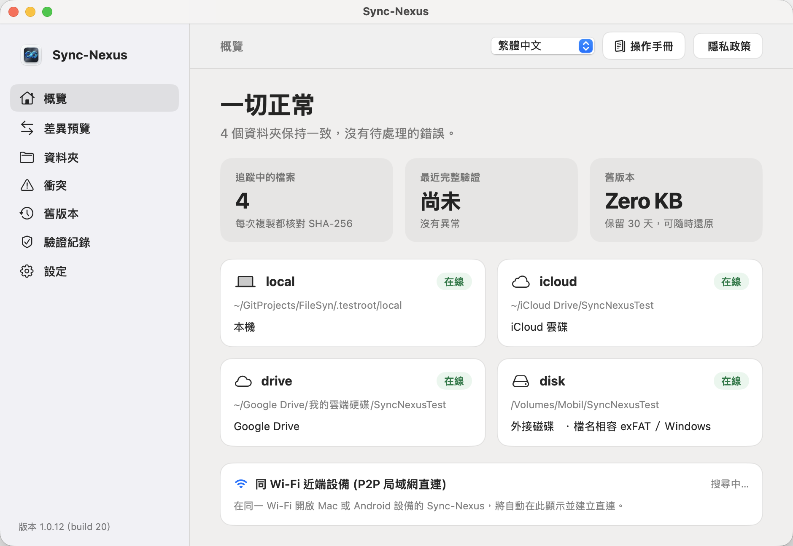
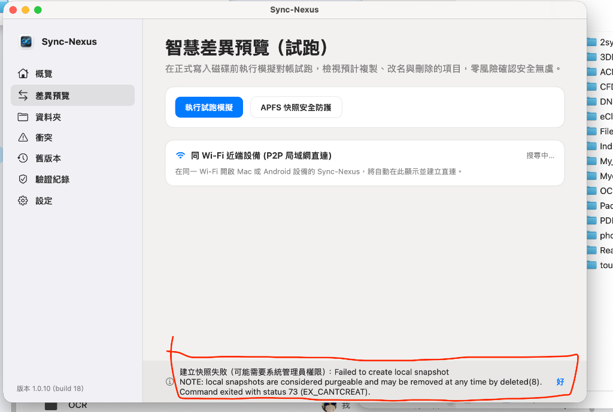
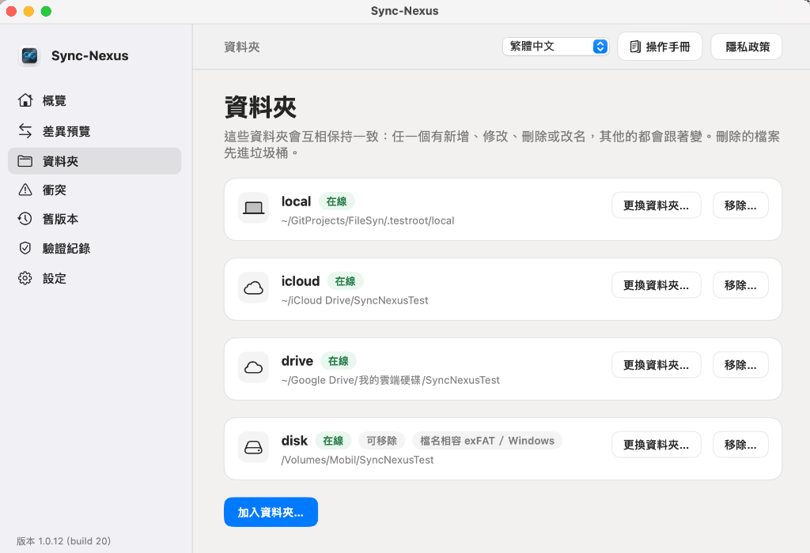
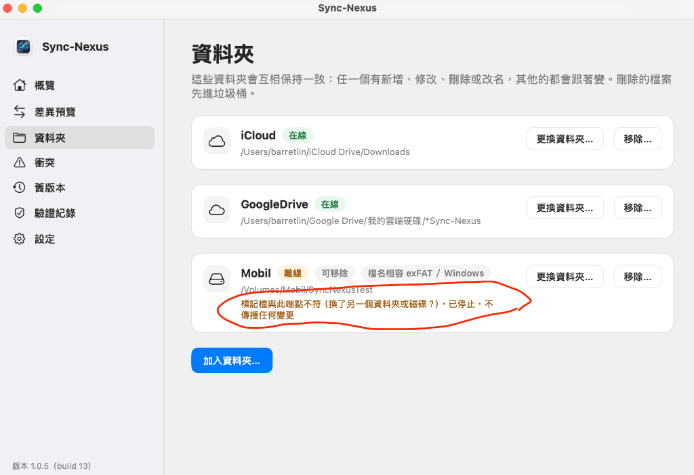
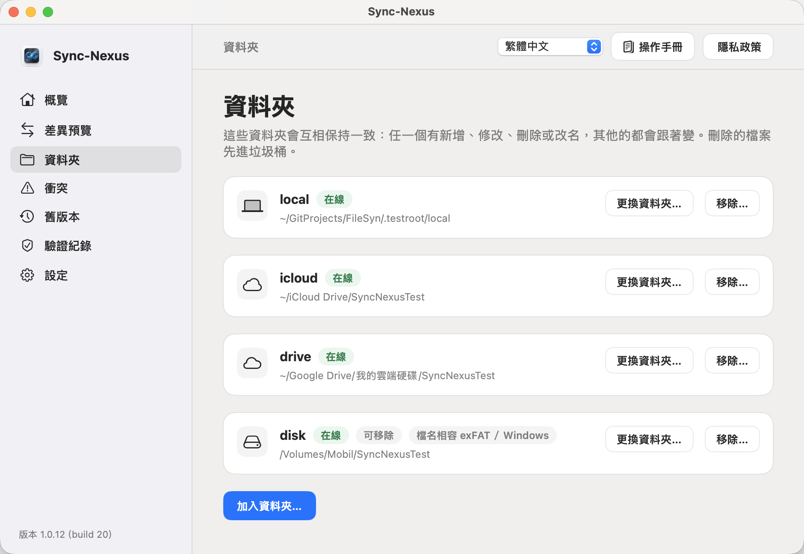
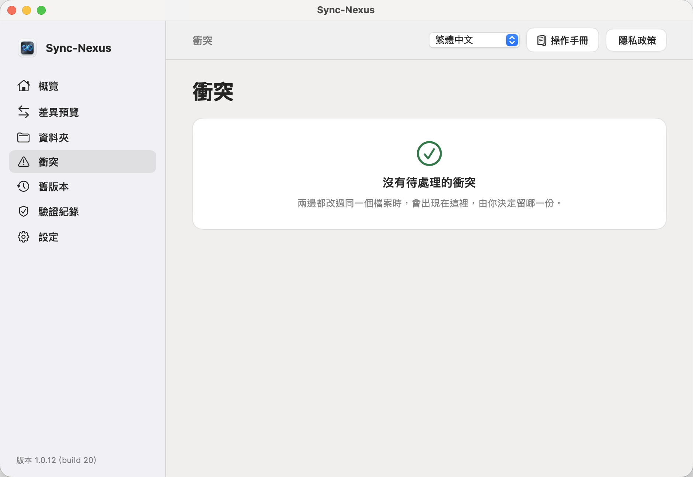
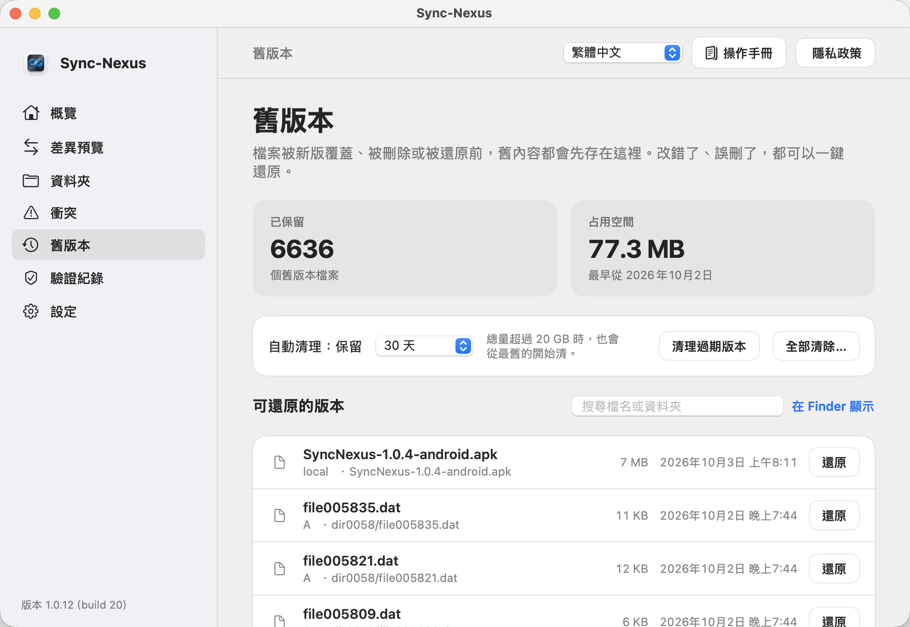
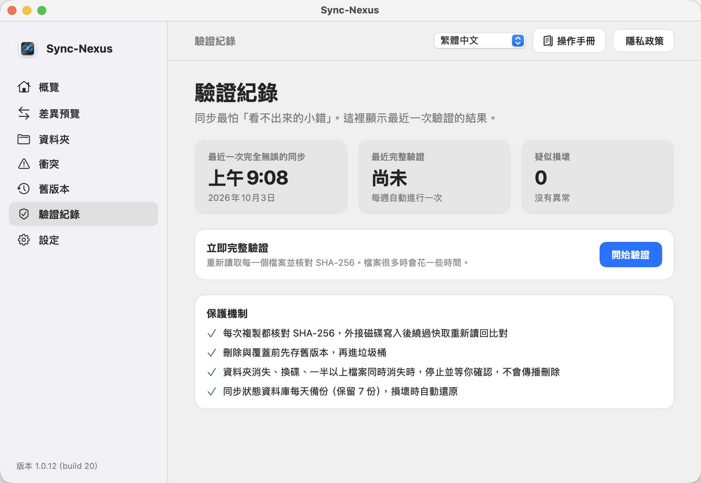
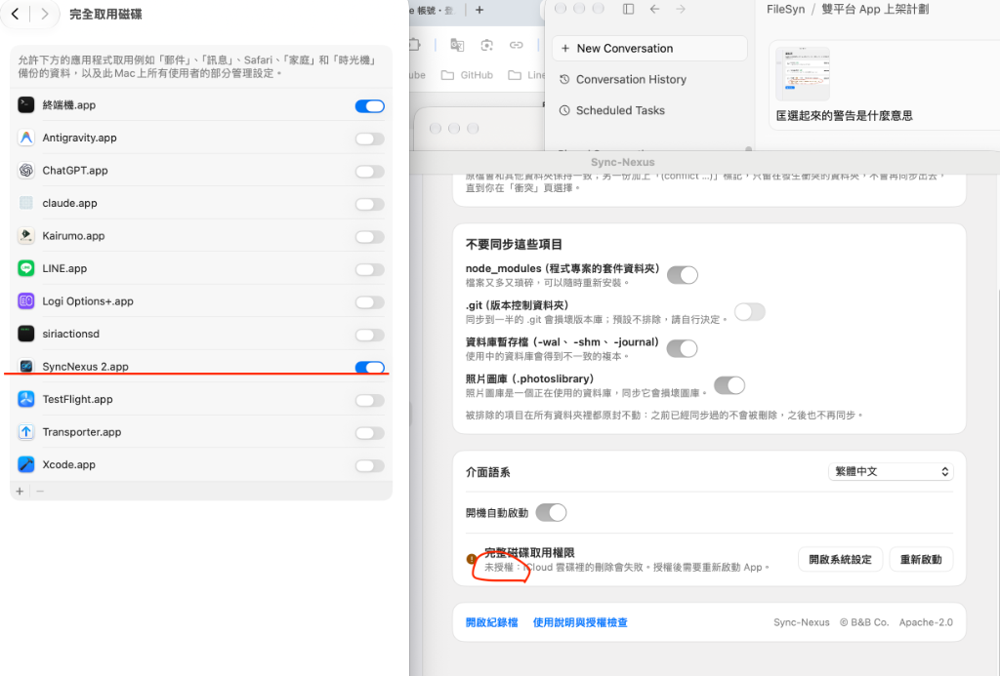

# SyncNexus 操作使用手冊 — Apple (macOS) 完整指南

> **適用平台**：macOS 14.0 (Sonoma) 及更新版本  
> **目前版本**：1.0.12（build 20）  
> **核心設計原則**：本機優先（Local-First）、零雲端伺服器綁定（Zero-Cloud）、絕對資料安全（Trash-First & History-Protected）

---

## 頁首導覽列功能說明

在主視窗的最上方，配置了全域操作的頁首導覽列：

```
[ 當前頁面主題標題 ] ------------------------- [ 語系切換下拉選單 ▾ ] [ 📖 操作手冊 ] [ 🛡️ 隱私政策 ]
```

1. **語系切換下拉式選單**：
   - **實際位置**：頁首右上角第一個控制元件。
   - **功能用途**：支援即時切換 6 種介面語系（繁體中文、簡體中文、English、日本語、한국어、ภาษาไทย）。
   - **操作方式**：點擊展開下拉選單，選取目標語言，整個應用程式介面立即切換，無須重啟。
2. **操作說明手冊按鈕（📖 圖示）**：
   - **實際位置**：語系選單右側。
   - **功能用途**：直接以原生應用內浮動視窗展開本操作手冊，免聯網、不重定向至 GitHub 網頁。
   - **操作方式**：點擊開啟，隨時查閱各頁面功能與操作指引；按 `Esc` 或「關閉」隨時返回工作畫面。
3. **隱私權政策按鈕（🛡️ 圖示）**：
   - **實際位置**：操作手冊按鈕右側。
   - **功能用途**：查閱 SyncNexus 的零雲端隱私安全規範與沙盒安全邊界。

---

## 第一章：概覽 (Overview)


### 1.1 頁面功能定位與目的
「概覽」是 SyncNexus 的**全局健康儀表板**。您無須深入檢查個別檔案，只要看一眼概覽頁，就能掌握整個同步系統的健康狀態、監控檔案總量、上次完整驗證時間、歷史版本容量與各端點連線狀況。

### 1.2 介面按鈕與功能說明

| 元件名稱 | 畫面實際位置 | 用途與目的 | 操作方式 | 產出之現象與安全機制 |
| :--- | :--- | :--- | :--- | :--- |
| **全局健康徽章** | 頂部主標題左側 | 顯示目前系統整體同步狀態（綠燈正常／黃燈警告） | 自動監控，無須手動操作 | 綠燈顯示「全部正常」；若有端點離線、檔案衝突或大量刪除，轉為黃燈提示。 |
| **大量變更確認卡片** | 頂部標題下方（僅異常時出現） | 防止手殘或惡意軟體瞬間清空檔案的最後防線 | 點擊卡片右側「**審核並確認**」 | 當單次刪除超過 25 個檔案或佔比 > 25% 時自動攔截並暫停同步，待您確認後才放行。 |
| **追蹤檔案數卡片** | 數據指標區第 1 格 | 即時呈現目前由 SyncNexus 納入同步監控的檔案總量 | 唯讀顯示 | 標註「SHA-256 即時追蹤」，每次檔案變動均即時更新數字。 |
| **最近完整驗證卡片** | 數據指標區第 2 格 | 追蹤上次執行深層 SHA-256 逐位元完整性比對的時間 | 唯讀顯示 | 若有疑似損壞檔案，下方副標題會即時顯示「發現 X 個疑似損毀」提醒您處理。 |
| **舊版本容量卡片** | 數據指標區第 3 格 | 呈現防誤刪歷史庫所佔用的磁碟空間與保留天數 | 唯讀顯示 | 顯示如「24.5 MB · 保留30天，可隨時還原」，點擊側欄「舊版本」可管理。 |
| **儲存端點狀態卡片** | 中央網格區域 | 檢視每個同步目錄的即時狀態、路徑與檔案系統特徵 | 檢視卡片資訊 | 顯示「在線」綠色徽章或「離線」黃色徽章；若為外接碟則標記「可移除 / ExFAT」。 |
| **P2P 局域網直連卡片** | 下方網路區塊 | 同 Wi-Fi 下自動尋找其他運行 SyncNexus 的 Mac 或 Android 設備 | 自動偵測搜尋中 | 發現設備時顯示設備名稱與綠色「在線」徽章，點對點直連傳輸。 |

---

## 第二章：差異預覽 (Diff Preview)



### 2.1 頁面功能定位與目的
在正式寫入磁碟之前，「差異預覽」提供**模擬對帳試跑（Dry-Run）**功能。對於管理重要專案、大容量資料夾的使用者，能事前預知即將複製、更名或刪除的項目，零風險確認安全無虞。

### 2.2 介面按鈕與功能說明

| 按鈕 / 元件名稱 | 畫面實際位置 | 用途與目的 | 操作方式 | 產出之現象與安全機制 |
| :--- | :--- | :--- | :--- | :--- |
| **執行試跑模擬** | 頂部主卡片左側（藍色主要按鈕） | 在不更動任何磁碟實體檔案的前提下，模擬比對所有端點差異 | 點擊按鈕，按鈕轉為「模擬計算中...」 | 計算完成後於下方展開詳細的預覽清單，顯示總變動筆數（如「共有 3 個項目即將同步」）。 |
| **確定執行同步** | 模擬清單右下方（審核無誤後出現） | 將預覽核對過的變更真正寫入至所有目標端點 | 點擊確認同步 | 系統立即啟動多端點檔案同步作業，頂部彈出同步成功快顯提示。 |
| **APFS 快照安全防護** | 「執行試跑模擬」按鈕右側 | 呼叫 macOS 系統級 APFS 快照，在大型變更前建立系統還原點 | 點擊按鈕觸發建立 | 成功時彈出「已建立 APFS 安全快照」；若磁碟格式不支援或非管理員權限，頂部跳出快顯 Toast 提示說明（如下圖）。 |



> **預覽符號說明**：
> - 🟢 **`+` (綠色圖示)**：預計新增或自其他端點複製過來的檔案。
> - 🔵 **`➔` (藍色圖示)**：預計在目標端點重新命名的檔案（避免重複傳輸）。
> - 🔴 **`−` (紅色圖示)**：預計刪除的檔案（**安全保證：一律先移入 macOS 垃圾桶，絕不硬刪**）。

---

## 第三章：資料夾 (Folders)



### 3.1 頁面功能定位與目的
「資料夾」是設定同步目標的核心頁面。SyncNexus 允許您將**多個不同的儲存位置**（本機資料夾、iCloud、Google 雲端硬碟、外接隨身碟）綁定為同一同步群組，任一處變更，其他處自動同步保持一致。

### 3.2 4 大儲存位置接地氣加入指南

請在頁面底部點擊「**加入資料夾...**」，依序加入至少 2 個您想保持同步的目錄：

1. **電腦本機資料夾**：
   - 打開「Finder（訪達）」，點擊左側側邊欄的「文件」或您的個人專屬目錄，選取準備要同步的資料夾。
2. **iCloud 雲碟 (iCloud Drive)**：
   - 打開「Finder（訪達）」，點擊左側側邊欄的「iCloud 雲碟」，選取您在 iCloud 內的專用資料夾。SyncNexus 自動處理雲端佔位符，確保檔案在本地水合（Download）後安全同步。
3. **Google 雲端硬碟 (Google Drive)**：
   - 打開「Finder（訪達）」，點擊左側側邊欄的「Google Drive」，點進「我的雲端硬碟」，選取要同步的資料夾。
4. **外接式隨身碟 / 行動硬碟 (USB / Type-C)**：
   - 將隨身碟插入 Mac 電腦，打開「Finder（訪達）」，在左側側邊欄「位置」下方點擊該隨身碟名稱，選取目錄。
   - **格式建議**：磁碟強烈建議格式化為 **ExFAT** 格式，SyncNexus 會自動啟動「檔名相容 ExFAT / Windows」過濾機制，確保跨平台檔名（如避免冒號 `:`、反斜線 `\`）完全相容！

### 3.3 介面按鈕與安全標記防偽機制

| 按鈕 / 元件名稱 | 畫面實際位置 | 用途與目的 | 操作方式 | 產出之現象與安全機制 |
| :--- | :--- | :--- | :--- | :--- |
| **加入資料夾...** | 列表底部藍色主要按鈕 | 授權並將新目錄加入多向同步網絡中 | 點擊並於 Finder 對話框中選取目錄 | 自動寫入 `.syncnexus-endpoint` 專屬 UUID 防偽檔，建立 App Sandbox 安全書籤。 |
| **更換資料夾...** | 每個端點卡片右側第一個按鈕 | 當目錄搬移或隨身碟掛載點改變時重新定向 | 點擊並選取新路徑 | 系統驗證標記檔無誤後自動恢復連線；若路徑無效則彈出提示。 |
| **移除...** | 每個端點卡片右側第二個按鈕 | 將該資料夾從同步清單中脫鉤 | 點擊並於確認對話框點擊確認 | 僅解除同步監控，**絕不會刪除資料夾內的實體檔案**。 |
| **防偽標記防護** | 端點卡片狀態警示區 | 防止插錯隨身碟或選錯目錄導致資料覆蓋 | 系統即時自動驗證 | 若隨身碟被更換，顯示「標記檔與此端點不符，已停止傳播任何變更」（如下圖），主動隔離保護！ |



---

## 第四章：衝突 (Conflicts)



### 4.1 頁面功能定位與目的
當您在無網路或離線狀態下，同時在兩台電腦修改了同一個檔案（例如 Mac 改了第 5 行、Windows 改了第 10 行），傳統軟體常會直接把其中一方蓋掉造成悲劇。SyncNexus 堅持**「絕對不覆蓋」原則**：將衝突版本妥善另存為 `檔名 (conflict ...)`, 並集中於本頁讓您自主比對與決定。

### 4.2 介面按鈕與雙版本仲裁說明

每個衝突項目均以卡片呈現，並列兩側版本資訊：

| 按鈕 / 元件名稱 | 畫面實際位置 | 用途與目的 | 操作方式 | 產出之現象與安全機制 |
| :--- | :--- | :--- | :--- | :--- |
| **保留此版本** | 左側「目前主要版本」卡片下方 | 決定採用主要版本內容作為標準版本 | 點擊按鈕 | 主要版本維持現狀並推播至其他端點，衝突副本安全歸檔。 |
| **改用此版本** | 右側「衝突副本版本」卡片下方（綠色標籤「較新」） | 決定以衝突副本的內容覆蓋並作為標準版本 | 點擊按鈕 | 衝突副本內容扶正為正式檔案，舊的主要版本自動移至「舊版本庫」備份。 |
| **在 Finder 中顯示** | 兩側版本卡片內均有配置 | 在 macOS 訪達中直接定位實體檔案 | 點擊按鈕 | 系統自動打開 Finder 並反白選取該檔案，方便您用文字編輯器比對。 |
| **無衝突狀態** | 列表無任何衝突時呈現 | 確認系統內沒有任何待決衝突 | 唯讀顯示 | 呈現綠色勾勾圖示「沒有未解決的衝突，所有檔案完全一致」。 |

---

## 第五章：舊版本 (Versions)



### 5.1 頁面功能定位與目的
「舊版本」是您的**歷史時光機與防手殘中心**。每當檔案被修改覆蓋、或是被同步覆寫時，被取代的舊內容會完整保存於 `.syncnexus-history` 資料庫中，讓您隨時可以一鍵找回昨天的草稿或被意外更動的內容。

### 5.2 介面按鈕與歷史管理說明

| 按鈕 / 元件名稱 | 畫面實際位置 | 用途與目的 | 操作方式 | 產出之現象與安全機制 |
| :--- | :--- | :--- | :--- | :--- |
| **歷史保留期限選單** | 頂部卡片「自動清理」右側下拉選單 | 設定舊版本檔案在硬碟中的最長留存期限 | 點選：7天 / 30天 / 90天 / 永久 | 超過設定天數的舊版本將於背景自動清理，釋放儲存空間。 |
| **清理過期版本** | 「歷史保留期限選單」右側按鈕 | 手動觸發立即清除已逾期的歷史舊檔案 | 點擊按鈕 | 即時釋放逾期檔案佔用的磁碟空間，並更新上方容量統計數字。 |
| **清空全部** | 「清理過期版本」旁按鈕 | 徹底釋放所有歷史版本庫空間（需謹慎） | 點擊並通過二次確認彈窗 | 僅清除歷史庫內之舊檔，**絕不影響正在使用的最新正式檔案**。 |
| **搜尋過濾框** | 歷史清單右上角文字框 | 在大量歷史記錄中以檔名或端點快速篩選 | 輸入關鍵字即時過濾 | 清單即時縮減為符合條件的檔案，支援副檔名與路徑搜尋。 |
| **在 Finder 中顯示** | 搜尋框右側按鈕 | 在訪達中檢視本機的 `.syncnexus-history` | 點擊開啟 Finder | 直達本機歷史備份目錄。 |
| **還原 (Restore)** | 每個歷史版本項目右側按鈕 | 將該特定歷史時間點的檔案救回並覆蓋回工作目錄 | 點擊「**還原**」 | 系統自動將該版本寫回原目錄，並立即同步至所有其他端點。 |

---

## 第六章：驗證紀錄 (Verification)



### 6.1 頁面功能定位與目的
現代硬碟可能發生無聲資料損壞（Silent Bit-rot），網路傳輸也可能遇到封包不全。SyncNexus 採用工業級 **SHA-256 雜湊技術**，對所有端點的所有檔案進行逐 Byte 深度比對，確保每一處檔案都真真切切百分之百一致。

### 6.2 介面按鈕與修復功能說明

| 按鈕 / 元件名稱 | 畫面實際位置 | 用途與目的 | 操作方式 | 產出之現象與安全機制 |
| :--- | :--- | :--- | :--- | :--- |
| **立即執行完整驗證** | 中央卡片右側藍色按鈕 | 啟動全端點深層 SHA-256 完整性雜湊比對 | 點擊「**立即驗證**」 | 背景掃描計算，驗證完畢後更新「最近完整驗證」時間與異常項目清單。 |
| **從其他端點修復** | 發現損壞異常項目時出現（主要按鈕） | 從健康完好的其他端點下載正確檔案覆蓋受損檔 | 點擊修復 | 自動從健康的端點提取乾淨副本覆寫，受損檔案先備份進歷史庫後修復。 |
| **接受目前內容** | 發現損壞異常項目時出現（次要按鈕） | 確認目前檔案內容為預期結果，重新計算雜湊 | 點擊接受 | 系統更新本機資料庫的基準雜湊，不再發出警示。 |
| **系統安全防線清單** | 頁面底部卡片 | 呈現 SyncNexus 內建的四大防護架構 | 唯讀查閱 | 標註：先進垃圾桶、防偽標記、大量刪除攔截、SHA-256 全時監控。 |

---

## 第七章：設定 (Settings)



### 7.1 頁面功能定位與目的
「設定」提供個人化的同步偏好微調，包含衝突處理策略、黑名單排除規則、多國語系以及 macOS 系統完全磁碟取用權限指引。

### 7.2 介面按鈕與偏好設定說明

| 設定項目 | 畫面實際位置 | 用途與目的 | 選項與操作方式 | 產出之現象與安全機制 |
| :--- | :--- | :--- | :--- | :--- |
| **衝突處理原則** | 頂部第一張卡片 | 設定發生雙邊同時編輯時的預設仲裁模式 | 單選：<br>1. **保留兩份，由我挑選**（推薦，預設）<br>2. **自動採用較新，舊的存進舊版本** | 選項 1 絕不覆蓋，保留 conflict 檔於「衝突」頁；選項 2 自動以修改時間最新為準，被覆蓋者送入「舊版本」。 |
| **排除規則開關** | 第二張卡片 | 排除無須同步或可能造成損壞的特殊目錄 | 獨立切換開關：<br>• `node_modules`（專案套件）<br>• `.git`（版本控制庫）<br>• 資料庫暫存檔（`-wal`, `-shm`）<br>• 照片圖庫（`.photoslibrary`） | 開啟後，該類型檔案於所有端點均原封不動，不予傳輸，大幅節省頻寬與硬碟負擔。 |
| **介面語系** | 第三張卡片頂部 | 設定軟體顯示語言 | 下拉選單選取 6 種語言 | 整個 App 即時切換語系。 |
| **開機自動啟動** | 語系設定下方切換開關 | 設定 Mac 開機登入時是否自動在後台啟動 | 開啟 / 關閉 Switch 開關 | 開啟後隨 macOS 登入自動於選單列後台守護，隨時保持同步。 |
| **磁碟取用權限** | 權限狀態卡片 | 檢查是否已取得系統檔案讀寫授權 | 顯示綠燈「已授權」或黃燈「未授權」 | 若未授權，點擊「**開啟系統設定**」直達 macOS「隱私權與安全性 ➔ 完全取用磁碟」（如下圖），將 SyncNexus 勾選開啟即可。 |
| **開啟日誌檔案** | 頁面底部左側按鈕 | 調閱即時同步偵錯與傳輸日誌 | 點擊按鈕 | 於系統「主控台（Console）」或文字編輯器中開啟即時日誌檢視。 |
| **使用說明指引** | 「開啟日誌檔案」旁按鈕 | 重新開啟初次安裝時的歡迎導覽視窗 | 點擊按鈕 | 彈出 Onboarding 引導精靈，方便回顧新手說明。 |



---

## 總結：日常安心使用守則

1. **放鬆工作，免手動按鍵**：只要端點均呈現「在線」，在任一資料夾內存檔或改名，2 秒內所有端點自動完成同步。
2. **有疑慮先「試跑模擬」**：在大批搬移或重整檔案前，先到「差異預覽」按一下「執行試跑模擬」，萬無一失。
3. **誤刪檔案免驚慌**：先翻 Mac「垃圾桶」；若已被清理，直接進「舊版本」頁面點擊「還原」，資料永遠都在！
